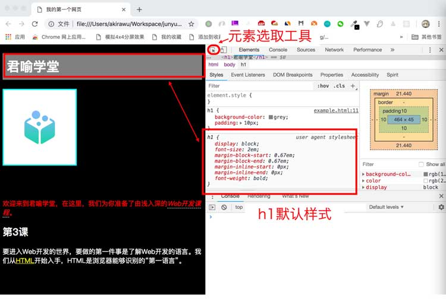
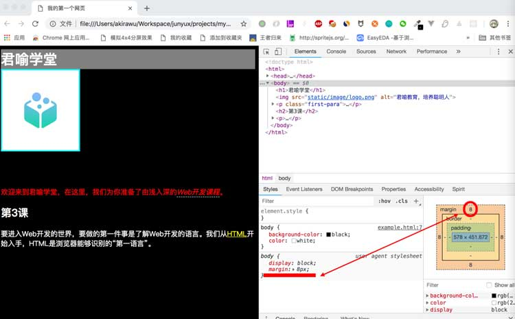
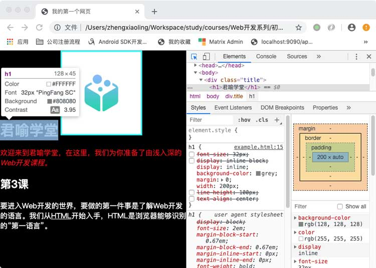
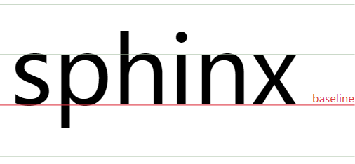

import {JCode} from '@/JCode'

# display属性

回顾第4节课说过的内容，HTML元素分为块级元素（block element）、行内元素(inline element)和行内块元素(inline block element)。

- 行内元素：能够和非块级元素并排显示在一行
- 块级元素：不论多少内容，块级元素都会占据整行空间
- 行内块元素: 综合了行内元素和块级元素的特性。

不同类型的元素，在浏览器中有不同的默认类型，比如h1是块级元素，em是行内元素，img是行内块元素。

## display

元素的类型可以通过CSS的display属性来改变。

display一个非常重要的属性，它指定了元素的显示类型，它有许多复杂的用法和众多枚举值，最常用的有以下几个：

- block 指定一个元素为块级元素
- inline 指定一个元素为行内元素
- inline-block 指定一个元素为行内块元素
- none 指定一个元素在文档流中不可见

### 块级元素

我们先来看看h1元素作为块级元素的特点。

为了方便观察h1元素盒模型的变化，我们将它的背景色设置为灰色。

```css
h1 {
  background-color: grey;
}
```

此时看到的页面效果如下：

<JCode codeId="7105245583685713950"/>

我们看到， 默认情况下 h1元素的宽度和浏览器的窗口宽度一样。

你也许会发现， h1元素的上下左右为什么都有空隙 。这是因为默认情况下， h1元素有外边距。

我们打开浏览器的[开发者工具](https://developers.google.cn/web/tools/chrome-devtools/)，选中对应的元素，查看CSS属性，可以看到h1上确实有默认的样式：



如果希望灰色背景覆盖整行空间，我们可以重设margin值，将默认样式覆盖：

```css
h1 {
  background-color: grey;
  margin: 0;
}
```

现在我们看到的页面效果变成了这样：

<JCode codeId="7105247293816700936"/>

我们看到现在h1标题底下的img元素紧贴在h1之下了，但是h1的上、左、右仍然有些空隙，这是怎么回事呢？

如果我们选中整个页面的body，查看开发者工具，会发现，body元素也有默认的margin：



所以我们增加body的样式规则：

```css
body {
  background-color: black;
  color: white;
  margin: 0;
}
h1 {
  background-color: grey;
  margin: 0;
}
```

<JCode codeId="7105248485716590623"/>

这下h1元素的上下左右都不再有空隙了。

接下来我们修改一下h1的样式，给它设置一个宽高，看看效果会是怎样：

```css
h1 {
  background-color: grey;
  margin: 0;
  width: 200px;
  height: 100px;
}
```

<JCode codeId="7105248994950905869"/>

我们看到，现在h1元素的宽度不再是窗口的宽度，而是占据一个固定宽高（宽200像素，高100像素）。

虽然，此时的h1的宽度是200px。但是，浏览器分配给h1元素的空间仍然是一行。 所以它后面的img元素并没有跑到上面来。

从前面的例子，我们看到， 块级元素的特点是

- 块级元素总是占据整行空间
- 能够识别宽高

### 行内元素

现在，我们通过display属性将h1元素的类型修改为行内元素。

```css
h1 {
  display: inline;
  background-color: grey;
  margin: 0;
  width: 200px;
  height: 100px;
}
img {
  width: 180px;
  padding: 50px;
  /* margin-bottom: 60px; */
  background-color: white;
  border: solid 3px cyan;
  box-sizing: border-box;
}
```

为了避免干扰，我去掉h1后面的img里（前一节课设置的）底部外边距`margin-bottom`。

我们看到，将h1元素的display设置为inline后， h1元素变成了行内元素，不再占据一整行的空间， 而是和图片元素 /并排显示。

<JCode codeId="7105249340624470053"/>

并且，我们发现，我们给h1元素设置的宽，高都失去了作用。此时, h1元素的实际宽高  分别是128px和45px。



这里就是inline和block的区别，根据规范，行内元素的宽高随元素内容而变化，因此**对于inline元素来说，设置width和height属性是无效的。**

通过前面的例子，我们知道，行内元素的特点是：

- 可以和非块级元素显示在同一行
- 它的宽高随元素内容而变化
- width属性和height属性对它无效

?> inline不仅设置width、height属性无效，设置paddingTop、paddingBottom、marginTop、marginBottom都不会影响周围元素的位置。实际上，设置marginTop、marginBottom无作用，设置paddingTop、paddingBottom能够影响background的范围，但它的占位空间依然和它的content大小一样， 也就不会影响周围元素的位置。paddingLeft、paddingRight、marginLeft、marginRight则能正常起作用。

<!--

inline设置line-height则和设置paddingTop/paddingBottom相反，能够影响周围元素的位置，但是不会影响background的范围。

-->

### 行内块元素

如果要元素并列在一行显示，同时还希望width、height/line-height依然生效并正常，那么就要将元素设置成行内块元素了，我们将h1修改成行内块元素：

```css
h1 {
  display: inline-block;
  background-color: grey;
  margin: 0;
  width: 200px;
  height: 100px;
}
```

<JCode codeId="7105250664082571294"/>

我们发现h1元素的width属性和height属性又产生作用了。

但是h1元素和它后面的图片元素的相对位置看起来有点奇怪，它们实际上是显示在同一行的空间。可是它们的底部没有对齐。

这是为什么呢？

#### 基线

原来根据标准，默认的元素行内对齐基准是基于基线（baseline）。那么什么是基线呢？

其实基线的概念大家应该不陌生，我们刚学习汉语拼音或英文字母的时候，书写用的四线格练习本中，第三线就是英文/拉丁文字母的基线。



汉字不采用基线，但是因为系统默认的文字排版是基线对齐，所以图片底部默认和“基线”对齐，这样会比汉字底部稍高。为了便于观察，我们给h1里增加几个英文字母：

```html
<h1>稀土教程 edu.juejin.cn</h1>
```

为了让英文和中文显示在同一行， 我们增加了h1元素的宽度，并取消了高度的设置。

```css
h1 {
  display: inline-block;
  background-color: grey;
  margin: 0;
  width: 400px;
}
```

现在我们看一下效果：

<JCode codeId="7105251227004305444"/>

这下我们可以很清晰看出，实际上img对齐的是h1的基线，所以为了让它们底部对齐而不是基线对齐，只需要设置img的一个叫做`vertical-align`的css属性：

```css
img {
  width: 180px;
  /* margin-bottom: 60px; */
  padding: 50px;
  background-color: white;
  border: solid 3px cyan;
  box-sizing: border-box;
  vertical-align: bottom;
}
```

现在图片元素和h1元素的底部就对齐了。

<JCode codeId="7105252073632956453"/>

`vertical-align`属性常用值如下：

- baseline 默认值，以元素基线对齐
- top 以元素顶部对齐
- middle 以元素中线对齐
- bottom 以元素底部对齐

从上面的例子，我们可以看到，行内块元素的特点是：

- 它可以和非块级元素显示在同一行
- width属性和height属性对它有效

## 小结

这节课主要介绍了 CSS 通过元素的display改变元素的类型

- display: block 将元素设置为块级元素
- display: inline 将元素设置为行内元素
- display: inline-block 将元素设置位行内块元素
