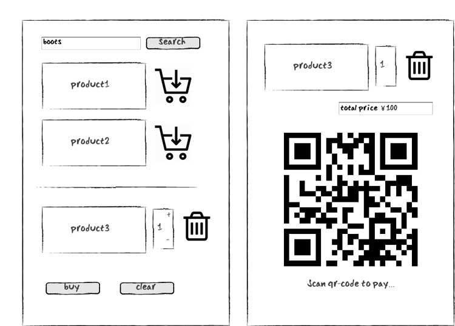
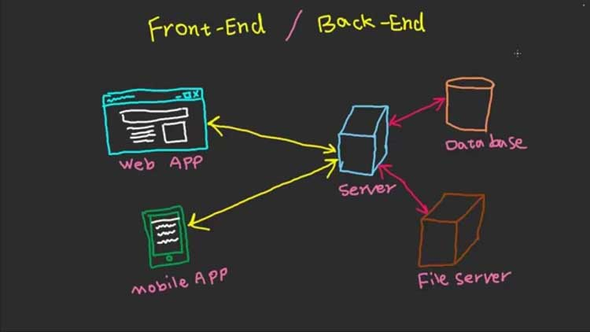
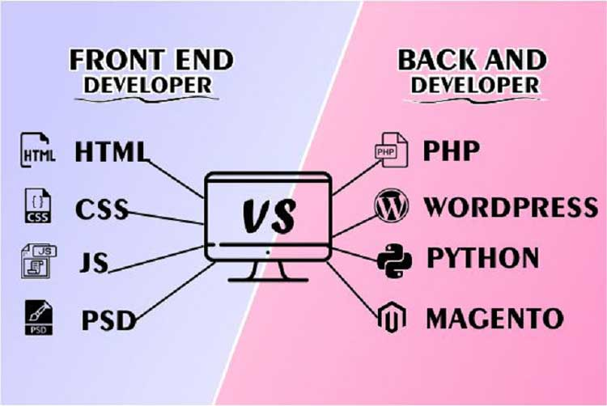

# 什么是前端工程师

互联网的发展基于网络协议，网络协议负责终端与云服务器之间的通讯，数据通过协议一头连接终端用户，另一头连接着中心化的服务器。

当你打开浏览器，输入一个网址，访问一个网页的时候，HTTP协议将网址解析并发送请求给对应的服务器，服务器根据请求的内容处理数据，将正确的数据返回给浏览器终端，于是你就能看到你想要看到的网页内容。

网页上的一系列操作包含了客户端和服务端之间的数据传输和处理。下面我们用一个网购的例子来说明这一过程。

首先，我们从电商网站的搜索框输入想要搜索的商品类型，在出现的商品列表中选取钟意的产品，并将其添加入购物车，之后核对购物车中商品的内容和价格，点击购买，付款，完成订单的支付。这一系列行为的背后包含了：数据的传输和交换，（比如搜索商品和提交购买）内容呈现和交互行为，（比如呈现商品列表，选中商品，添加购物车）。

在上述的网购例子中，展示商品列表，响应用户选中商品，将选中的商品添加入购物车、修改想要购买的商品数量等行为都是在客户端完成的。而用户在完成客户端的操作后，比如提交搜索数据，提交订单，付款等操作后，这些数据被发完服务端，由服务端处理后，再把结果数据送回客户端。

一般而言，我们把Web开发中，需要在服务器上完成的部分归类为“服务端开发”或“后端开发”，而把在浏览器内完成的部分归类为“前端开发”。因此，我们把专注于处理服务端数据的工程师称为后端工程师，把专注于处理浏览器内容呈现和行为交互的工程师称为前端工程师。

在大多数互联网公司的技术体系里，后端工程师和前端工程师是两种不同的角色，它们的技术栈和能力要求是不同的，对于前端工程师来说，最核心的工作是将UI设计师设计的效果最终制作成用户可用的网页，使用的技术主要是HTML、CSS和JavaScript。对于后端工程师来做，核心的工作则是根据产品的业务需求处理提交到服务器的数据，将需要存储的数据写入数据库，将需要返回给用户的数据从数据库中取出并组织成正确的结构返回。服务端开发的常用语言包括PHP、Python、Java和JavaScript(Node.js)等。

由于绝大多数Web产品既需要服务端能力，也需要前端能力，因此前端工程师和后端工程师又是紧密配合的，是Web开发领域不可或缺的两个核心角色。要成为优秀的Web开发工程师，通常既需要了解前端、也需要了解后端。

本课程专注于前端开发的部分，即如何处理客户端浏览器上的内容呈现和用户交互。由于本课程是Web开发系列课程的第一课，因此我们不会太过深入到技术细节当中，而是通过一个实战的例子，帮助大家尽量全面地了解前端工程师工作的方方面面，使大家对前端工程师的角色定位和工作流程有个完整的印象。

通过本课程，你将学习到如下知识：

1. 学会使用基本的HTML/CSS/JS开发构建一个简单的内容呈现网站
1. 学习并理解以下HTML内容：
    1. 什么是HTML
    1. DOCTYPE
    1. 一部分语义标签
    1. 基本盒模型
    1. 简单布局
1. 学习并理解以下CSS内容：
    1. 一部分选择器
    1. 一部分样式规则
1. 学习并理解以下JS内容：
    1. 一部分语法
    1. 简单操作DOM
1. 发布你的网页到GitHub

一个好消息是，由于前端是和用户打交道的领域，因此前端技术本身即是关于如何呈现UI的技术，课程中完整的练习和项目都能实实在在地看到视觉效果，这使得课程学习的过程能够相对直观、形象、有趣而不乏味。然而，前端本身也是属于Web工程师体系，技术的学习和使用也是需要严谨和规范的，因此在本课程学习的过程中，除了实战开发的效果呈现以外，我们也需要把其中涉及的知识点整理总结与提炼，把握其脉络，做到“知其然亦知其所以然”，避免走到只重效果不重技术的极端。效果呈现是前端开发的重点，但技术是基本功，只重效果，短期内确实能极快见到成效，但长期发展必然会因为技术积累不够而陷入成长瓶颈。

那么我们接下来就准备进入课程的学习，祝愿各位在将来都能成为优秀的Web开发工程师。

import {Pagination} from '@/pagination'

<Pagination
  next={{name: '下一节', src: 'design_a_blog'}}
/>
