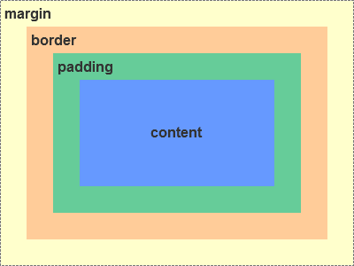
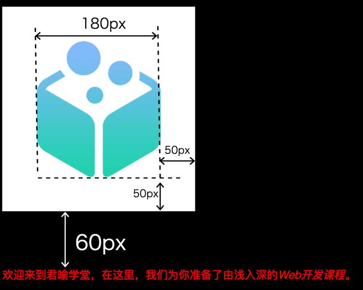
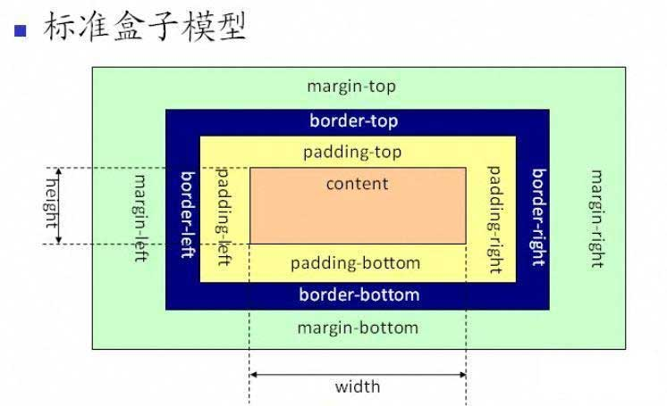
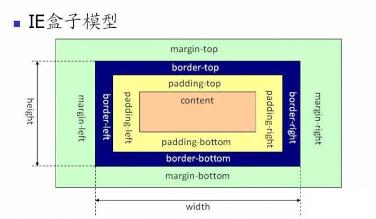

import {JCode} from '@/JCode'

# 元素盒子

在CSS中，所有的元素都被一个个的“盒子（box）”包围着，理解这些“盒子”的基本原理，是我们使用CSS实现准确布局、处理元素排列的关键。

## 盒模型

在HTML中，元素节点和文本节点是网页呈现的基本单位。文本节点比较简单，呈现的就是文字内容本身，而包裹着文本节点的元素节点则基本上决定了内容呈现的形式。


那么CSS究竟能改变元素节点的哪些属性呢，这些属性之间有什么关联？

通过上一节课，我们知道，CSS能改变的属性很多，比如：元素的大小位置、背景字体、空白间隔和一些动态效果等，都能用CSS来设置和改变。其中一些元素还有自己特殊的属性。如果把这些都算上，CSS可设置的属性大概有上百种。

如果你仔细观察过各种Web应用和网站的界面，你会发现这些网页，无论是复杂的、简单的、宽的、窄的、简洁的、花哨的，本质上都是**以结构化的方式来呈现网站内容**。

HTML本身天然的结构化特征（还记得我们在第3节课学的内容吧？）使得我们能够以结构化的方式来快速组织内容，而CSS把这些结构化内容具象化并呈现到屏幕上。在这里HTML元素节点承担起占位并给其中文字内容留下呈现空间的职责，具体的占位方式、大小和空间相关的控制就由一系列CSS属性来完成。

形象地看，元素是作为内容外边的**“盒子”**存在的。盒子的大小和文字内容在盒子中的摆放则由一组CSS控制，所以我们把这个称为**盒模型（box model）**。

盒模型从内到外由以下几部分构成：

- content 内容，即盒子中间的具体内容，可以是文字内容，也可以是嵌套的子元素盒子。
- padding 内边距，即盒子内容与盒子边界之间的空间。
- border 边框，即盒子四周呈现的边界
- margin 外边距，即盒子边框之外和其他盒子之间留出的空间。



padding、border、margin都可以由CSS对应的属性控制，下面我们通过例子来学习一下。

我们继续给example.html的例子添加CSS规则：

```html
<!DOCTYPE html>
<html>
  <head>
    <meta charset="UTF-8">
    <title>我的第一个网页</title>
    <style>
    body {
      background-color: black;
      color: white;
    }
    p.first-para {
      color: red;
    }
    a:link {
      color: white;
    }
    a:hover {
      color: green;
    }
    a:active {
      color: orange;
    }
    a:visited {
      color: yellow;
    }
    img {
      background-color: white;
      width: 180px;
      padding: 50px;
      margin-bottom: 60px;
    }
    </style>
  </head>
  <body>
    <h1>稀土教程</h1>
    
    <p class="first-para">欢迎来到稀土教程，在这里，我们为你准备了由浅入深的<em>Web开发课程</em>。</p>
    <h2>第3课</h2>
    <p>要进入Web开发的世界，要做的第一件事是了解Web开发的语言。我们从<a href="https://developer.mozilla.org/zh-CN/docs/learn/HTML/Introduction_to_HTML">HTML</a>开始入手，HTML是浏览器能够识别的“第一语言”。</p>
  </body>
</html>
```

这一次我们给img元素添加了一个CSS规则：

```css
img {
  background-color: white;
  width: 180px;
  padding: 50px;
  margin-bottom: 60px;
}
```

现在我们的网页看起来如下：

<JCode codeId="7105240275684950052"/>

可以看到，图片的呈现形式发生了改变，具体改变了哪些内容，我把它标记一下：



接下来我们一步一步看img规则中的四个属性是如何造成这些改变的：

`background-color: white;` 这个我们前面已经学过了，将图片（原本透明）的背景色置为白色。

`width: 180px` 这一步将content（这里是图片内容）的宽度设置为180像素。`px`是一个CSS单位，它的含义是pixel，也就是像素的意思。像素可以理解为屏幕上的一个点，180px的意思就是指定图片内容的宽度占据180个像素点。

!> 除了px之外，CSS中还有其他单位，我们将在后续的课程中详细介绍。

`padding: 50px` 这一步将padding的空间设置为50像素，前面我们说过padding是内边距的意思，因此它的作用范围是在background-color的范围内的。后续我们还将尝试给图片设置border，你会看到，padding范围在border与content中间。

`margin-bottom: 60px` 这一步将margin-bottom的距离设置为60像素，意思是它底部距离后面的元素之间保留60像素的空间。

像padding和margin这样的属性，实际上包含四个方向，分别是top、right、bottom、left。在CSS中可以分开对它们设置，也可以合在一起设置。因此`padding: 50px`实际上是一个缩写，相当于：

```css
{
  padding-top: 50px;
  padding-right: 50px;
  padding-bottom: 50px;
  padding-left: 50px;
}
```


即使是四个方向的值不同，我们也可以用缩写，每个值用空格隔开，因此：

```css
{
  padding-top: 50px;
  padding-right: 60px;
  padding-bottom: 70px;
  padding-left: 80px;
}
```

也可以写成：`padding: 50px 60px 70px 80px`(依次表示上边距，右边距，下边距，左边距)。

### border 边框

接下来，我们给img添加一个边框，这可以通过设置border属性来实现。

```css
img {
  background-color: white;
  width: 180px;
  padding: 50px;
  margin-bottom: 60px;
  border: solid 3px cyan;
}
```

<JCode codeId="7105242129064017934"/>

我们给图片设置了一个青色的实线边框，宽度是3像素。

border属性也是一个缩写，它由三个属性组成：

```css
{
  border-style: solid;
  border-width: 3px;
  border-color: cyan;
}
```

`border-style`表示边框的样式，默认是solid即实线，还可以设置为其他可能的值，如double表示双线、dashed表示虚线、dotted表示点状线。

?> 如果你想了解关于border-style的详细内容，可以阅读[MDN border-style](https://developer.mozilla.org/zh-CN/docs/Web/CSS/border-style)。

`border-width`表示边框的宽度，前面我们解释过px单位，`border-width:3px;`即边框为3像素宽。

`border-color`表示边框的颜色。

除了整体设置四周的边框，边框还能分别设置top、right、bottom、left一侧。我们通常使用单侧的边框来修饰文字，比如：

```css
em {
  border-bottom: dashed 1px white;
}
```

这样我们给`<em>Web开发课程</em>`这段文字添加了白色的虚线下划线效果。

<JCode codeId="7105242489707053064"/>

### 标准盒模型

注意到上面的例子中，我们设置的`width:180px;`作用于实际图片，也就是content本身，这是CSS标准盒模型规定的。

盒模型定义了元素实际的**占位大小**，如下所示：

- 总宽度 = width + 左右padding + 左右border + 左右margin
- 总高度 = height + 上下padding + 上下border + 上下margin

这一盒模型被称为**标准盒模型**，是现在Web标准浏览器默认的盒模型。

（**注意：这里是元素的占位大小，不是元素的大小**）



### IE盒模型

除了标准盒模型以外，还有一种IE盒模型。和标准盒模型不同，IE盒模型中宽高不是作用于content，而是作用于content、padding、border这三个部分。这种模式以前被称为怪异模式（quirk mode）。如图所示：



### box-sizing

我们可以通过改变CSS属性`box-sizing`来切换两种盒模型。`box-sizing`属性是一个可继承属性，默认值是`inherit`，表示继承父类的盒模型，可以改为`content-box`或`border-box`，前者是标准盒模型，后者是IE盒模型。

```css
img {
  background-color: white;
  width: 180px;
  padding: 50px;
  margin-bottom: 60px;
  border: solid 3px cyan;
  box-sizing: border-box;
}
```

设置了`box-sizing:border-box;`之后，我们发现图片变小了，这是因为之前采用的标准盒模型，图片的宽度是180px，元素实际占位宽度是`180+50x2+3x2+0x2=286px`。现在改成了IE盒模型，元素实际占位宽度是180px，图片本身的宽度则是`180-50x2-3x2-0x2=74px`。

<JCode codeId="7105242887884898335"/>

## 小结

这一节课主要介绍了元素的盒模型。在标准盒模型下，元素的width和height只定义了content的宽度和高度，而元素的占位总宽度和高度分别如下： 

- 总宽度 = width + 左右padding + 左右border + 左右margin
- 总高度 = height + 上下padding + 上下border + 上下margin

在IE盒模型下，宽高不是作用于content，而是作用于content+padding+border， 如下所示：

- width = content.width + 左右padding + 左右border
- height = content.height + 上下padding + 上下border

box-sizing属性可以改变元素的盒模型。

import {Pagination} from '@/pagination'

<Pagination
  previous={{name: '上一节', src: 'learn_css'}}
  next={{name: '下一节', src: 'display_attribute'}}
/>