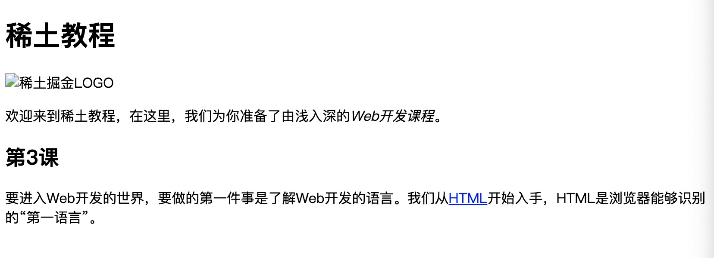
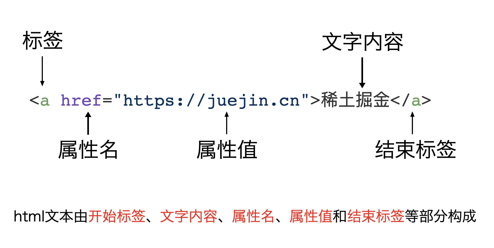
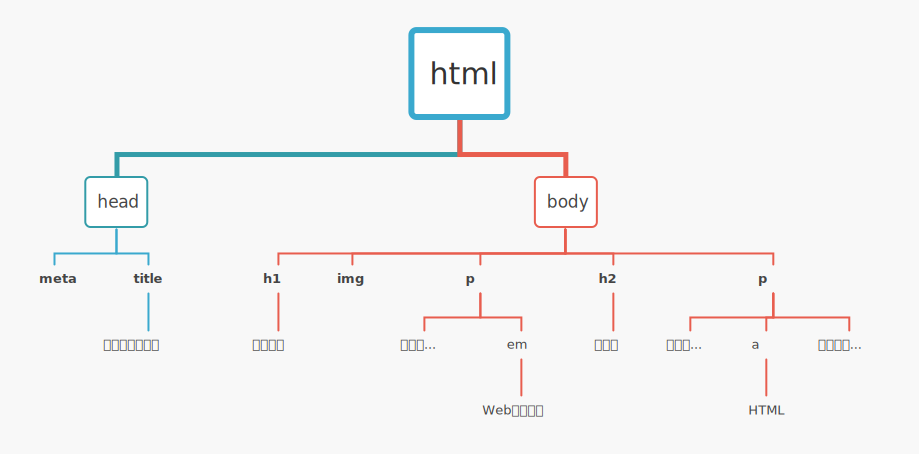

import {JCode} from '@/JCode'

## 什么是HTML

HTML是超文本标记语言的缩写，它是浏览器能够识别并处理的一种文本语言。

HTML由标签和文本内容组成，标签告诉浏览器以何种方式显示标签中的文本内容。

我们先来尝试一下书写HTML：

我们打开[码上掘金](https://code.juejin.cn)，新建空白片段，将Markup窗口中的代码替换为如下代码：

```html
<h1>稀土教程</h1>
```

然后将它保存，点击运行，我们能看到右侧浏览器窗口中输出的文字内容：

<JCode codeId="7104996817812586504"/>

网页中显示的文本字体“稀土教程”四个字被加粗加大显示。这是因为，我们给“稀土教程”四个字添加了一个`h1`标签，对浏览器而言，`h1`标签表示的语义是一级标题，也就是说`<h1>`和`</h1>`之间的内容会被作为网页一级标题来显示，因此浏览器将字体加大加粗了。

我们可以给网页增加新的内容：

```html
<h1>稀土教程</h1>
<p>欢迎来到稀土教程，在这里，我们为你准备了由浅入深的Web开发课程。</p>

```

<JCode codeId="7104997547747491854"/>

现在，我们看到网页上在“稀土教程”的下方增加了一行文字内容，这行文字内容在文件中我们写在`<p>`和`</p>`标签之间，在浏览器中，`p`标签表示其中的文字这是一个段落。

所以，我们看到，HTML文本是用标签包围的文字，标签通常**成对**，包括起始标签和结束标签，例如前面例子里`<h1>`和`</h1>`就是一对起始标签和结束标签，同样`<p>`和`</p>`也是一对起始和结束标签。

对于网页来说，每一对标签构成一个**元素**，标签的字母是**标签名**，例如`<h1>`和`</h1>`构成一个`h1`元素，`<p>`和`</p>`构成一个`p`元素。HTML规范了标签名对浏览器表示的意思，也叫做标签的**语义**。例如`h1`表示一级标题，`p`表示段落等等。

?> **语义**是一个HTML的非常重要的概念，从某种意义上说，撰写HTML网页的过程就是将要呈现给用户的内容以特定结构组织并用相应的**语义标签**来表达的过程。

在后续的课程中我们会进一步详细介绍**语义**和**语义化**的相关知识，理解它们是写好HTML代码的基础。

### 标签嵌套

HTML的结构是嵌套的，也就是说，一些标签之间的内容里还可以有其他标签，我们继续修改html文件内容，在`p`标签之间的文本内容中嵌套其他的标签：

```html
<h1>稀土教程</h1>
<p>欢迎来到稀土教程，在这里，我们为你准备了由浅入深的<em>Web开发课程</em>。</p>
```

<JCode codeId="7104998251014979620"/>

我们看到，“Web开发课程”的内容包含在`em`元素中，它和其他的文字内容包含在`p`元素中，所以`p`元素嵌套了`em`元素。

在`em`元素中的“Web开发课程”被浏览器显示为斜体，这是因为HTML规范里，`em`表示强调内容，默认的显示样式是斜体文字。

通常，HTML文档由许多个标签构成，让我们继续增加其他元素：

```html
<h1>稀土教程</h1>
<p>欢迎来到稀土教程，在这里，我们为你准备了由浅入深的<em>Web开发课程</em>。</p>
<h2>第3课</h2>
<p>要进入Web开发的世界，要做的第一件事是了解Web开发的语言。我们从<a href="https://developer.mozilla.org/zh-CN/docs/learn/HTML/Introduction_to_HTML">HTML</a>开始入手，HTML是浏览器能够识别的“第一语言”。</p>
```

<JCode codeId="7104999391274106917"/>

在这里，我们添加了一个`h2`元素和另一个`p`元素，`h2`元素表示二级标题，`p`元素表示段落。在`p`元素中我们还嵌套了一个`a`元素，`a`元素表示它其中包含的内容是超链接。

注意一下`a`元素，它的写法与其他元素不同，它的起始标签不仅有标签名，还包含有一个属性`<a href="...">`。

### 元素属性

HTML元素的起始标签不仅仅可以包含标签名，还可以在标签中包含一些**属性**，这些属性通常给元素提供额外的信息，浏览器也能根据这些信息决定内容显示或交互的形式。

属性一般是以`属性名="属性值"`的格式写在HTML标签中，如前面这个`a`元素中指定的属性名是`href`，属性值是一个URL地址：`https://developer.mozilla.org/zh-CN/docs/learn/HTML/Introduction_to_HTML`。

HTML规范规定，如果`a`元素的`href`属性值设置为一个URL，那么我们鼠标点击`a`标签中的文字后，浏览器就会将网页跳转到这个URL表示的网址。

!> 你可以试着点一下页面上蓝色下划线的“HTML”文字，浏览器会跳转到MDN官网，打开页面`Introduction_to_HTML`。

一个HTML标签中可以写多个属性，属性与标签名、属性与属性之间以空格隔开。我们马上会看到多个属性的例子。

接下来，我们继续给HTML文件添加更多元素。

```html
<h1>稀土教程</h1>

<p>欢迎来到稀土教程，在这里，我们为你准备了由浅入深的<em>Web开发课程</em>。</p>
<h2>第3课</h2>
<p>要进入Web开发的世界，要做的第一件事是了解Web开发的语言。我们从<a href="https://developer.mozilla.org/zh-CN/docs/learn/HTML/Introduction_to_HTML">HTML</a>开始入手，HTML是浏览器能够识别的“第一语言”。</p>
```

我们在`h1`元素和`p`元素之间添加了一个`img`元素。在HTML里，`img`元素表示一个图片。在这个元素上我们设置了两个属性，一个`src`属性，表示这个图片的URL，浏览器加载网页的时候，会根据这个URL下载相应的图片，还有一个`alt`属性，表示这个图片的替代文字，当网络问题或者图片src属性表示的URL不能访问时，浏览器会在图片呈现的地方显示替代文字。

所以现在页面看起来如下：

<JCode codeId="7105001307227815973"/>

如果打开网页的时候网络出问题图片不能加载，那么页面看起来如下（浏览器显示一个图片请求失败的图标和alt属性中的替代文字）：



?> `img`元素没有包含文本内容，它也没有结束标签。HTML规范中，部分元素只有开始标签没有结束标签，这部分元素被称为**自闭合**元素。`img`元素是一个自闭合元素。

目前为止，我们已经写了一个简单的HTML页面，并让浏览器加载和呈现出来。在这个页面上，有一级标题（h1）、二级标题（h2）、图片（img）、段落文本（p）、强调文字(em)以及超链接（a）。

但是，仅仅这样还不够，HTML文档还有它自身的结构，我们把上面的内容放到一个`body`元素中：

```html
<body>
  <h1>稀土教程</h1>
  
  <p>欢迎来到稀土教程，在这里，我们为你准备了由浅入深的<em>Web开发课程</em>。</p>
  <h2>第3课</h2>
  <p>要进入Web开发的世界，要做的第一件事是了解Web开发的语言。我们从<a href="https://developer.mozilla.org/zh-CN/docs/learn/HTML/Introduction_to_HTML">HTML</a>开始入手，HTML是浏览器能够识别的“第一语言”。</p>
</body>
```

然后我们在`body`元素前面添加一个`head`元素，并将它们放到`html`元素中。

```html
<html>
  <head>
    <meta charset="UTF-8">
    <title>我的第一个网页</title>
  </head>
  <body>
    <h1>稀土教程</h1>
    
    <p>欢迎来到稀土教程，在这里，我们为你准备了由浅入深的<em>Web开发课程</em>。</p>
    <h2>第3课</h2>
    <p>要进入Web开发的世界，要做的第一件事是了解Web开发的语言。我们从<a href="https://developer.mozilla.org/zh-CN/docs/learn/HTML/Introduction_to_HTML">HTML</a>开始入手，HTML是浏览器能够识别的“第一语言”。</p>
  </body>
</html>
```

<JCode codeId="7105003766851567629"/>

注意到我们在`head`元素中还添加了两个元素，一个是`meta`元素，一个是`title`元素。`title`元素中的文本内容不会直接呈现在网页中，而是显示在浏览器地址栏上方的标签栏中。`meta`标签是描述文档元数据的标签，它不会被直接显示出来，而是提供HTML文档的一些额外信息，在这里`<meta charset="UTF-8">`告诉浏览器当前网页的编码是`UTF-8`编码。`meta`元素也是自闭合的，因此不需要有结束标签。

上面的代码已经具备了完整的HTML结构，大多数现代浏览器都能正确解析和展现它。但是为了让较早期的浏览器能够正确识别HTML的版本，我们还需要在文件的第一行添加一个`doctype`声明：

```html
<!DOCTYPE html>
<html>
  <head>
    <meta charset="UTF-8">
    <title>我的第一个网页</title>
  </head>
  <body>
    <h1>稀土教程</h1>
    
    <p>欢迎来到稀土教程，在这里，我们为你准备了由浅入深的<em>Web开发课程</em>。</p>
    <h2>第3课</h2>
    <p>要进入Web开发的世界，要做的第一件事是了解Web开发的语言。我们从<a href="https://developer.mozilla.org/zh-CN/docs/learn/HTML/Introduction_to_HTML">HTML</a>开始入手，HTML是浏览器能够识别的“第一语言”。</p>
  </body>
</html>
```

`<!DOCTYPE html>`告诉浏览器，这个文档是HTML5文档。

!> 一些早期浏览器根据`doctype`声明来确定文档是HTML5、HTML4或者XHTML，可能将内容呈现为不同的样式，为了兼容早期浏览器，所以一般我们必须在HTML文件开头添加`doctype`声明。关于`doctype`声明的详细内容，在后续中、高级课程中还有机会具体讨论。

_补充：标签、属性与文本内容_



## 元素的层层嵌套

从HTML文档的结构上看，我们很容易发现HTML元素存在有层级关系，根据这个关系，我们可以将上面的HTML页面内容用一个树状的图来表示：



HTML是树状结构，浏览器解析HTML文档是从根节点向下依次读取和解析每一个节点。节点内容由起始标签开始，结束标签结束，其中可包含子节点或文字内容。标签节点在HTML中又被称为元素节点（Element Node），文字内容被称为文本节点（Text Node）。元素节点和文本节点是HTML文档中最常见的内容。

浏览器用对象来表示每个节点，在后面的课程中我们会学到，CSS样式作用于节点对象，JavaScript操作主体也是节点对象。这种以节点对象为主体的模型在浏览器中被称为“**文档对象模型（Document Object Model）**”，简称DOM。

为了统一概念和方便描述，在后续的课程里，我们把标签节点（即元素节点）统称为**元素**。例如网页上`<p>...</p>`标签，今后我们称为p元素。标签的子标签称为子元素，标签的父级标签称为父元素。

## 小结
本讲我们主要介绍了HTML文档书写规范， HTML文档的树形结构（即，DOM模型)，以及认识一些HTML标签。同学们可以通过[MDN](https://developer.mozilla.org/zh-CN/docs/Web/HTML)了解更多的html标签。下一节课里，我们将介绍如何使用html元素组织我们的博客页面。

### 👉🏻小练习

阅读下面的HTML片段，回答几个问题：

```html
<body>
  
  <h2><a href="https://book.douban.com/subject/2567698/">三体</a>节选</h2>
  <p>这时，罗辑才真正注意到他们置身其中的雕塑群，他发现那些柱状物并不是什么枯树，而是一只只从沙漠中向上伸展的手臂，这些手臂都瘦得皮包骨头，所以初看上去像枯树干，顶上的那些手都对着天空做出各种极度扭曲的姿态，像是表达着某种无尽的痛苦。</p>
  <p>“这是什么雕塑？”罗辑置身于这群对天挣扎的手臂中，虽然出了一身汗，还是感到阵阵寒意。在雕塑群的边缘，罗辑看到了一块肃穆的方碑，上面刻着一行金色的大字：<em>给岁月以文明，而不是给文明以岁月。</em></p>
  <p>“大低谷纪念碑。”史强说，他显然没有兴趣进一步解释，拉起罗辑向外走去，快步穿过了另一半广场</p>
</body>
```

1. 下面的HTML代码片段有哪些标签，哪些属性？
1. 其中自闭合标签有哪些？
1. 哪些元素带有子元素，它们的标签分别是？
