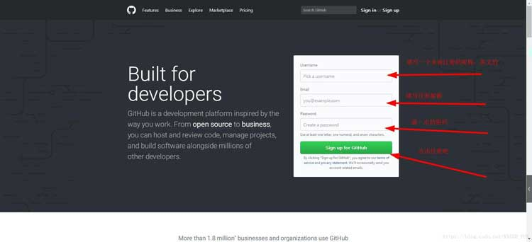
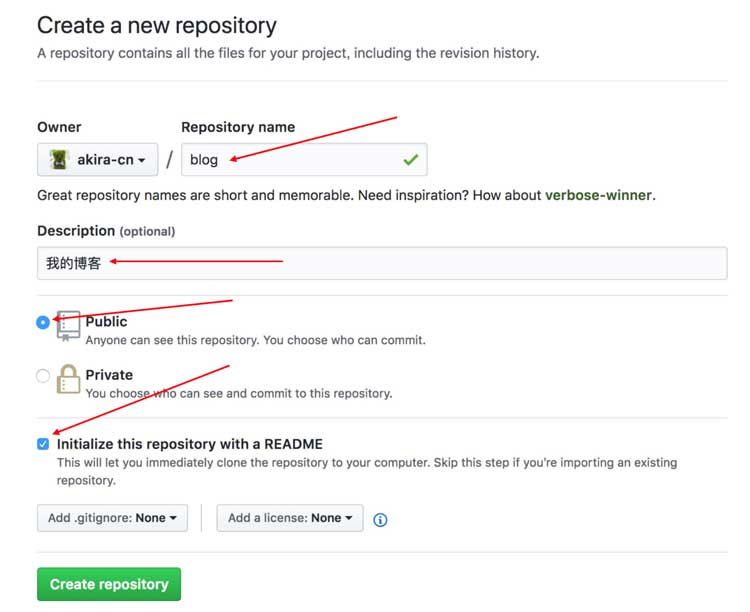
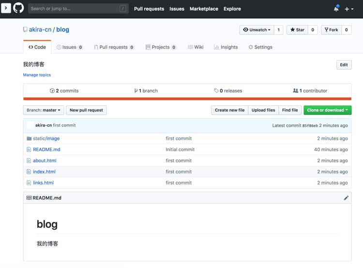

# 发布你的博客作品

这一节课我们把前面完成的博客发布到互联网上去，让用户真正可以访问，后续我们可以使用我们自己的博客来真正记录我们学习和积累的点点滴滴。

另外，我们在后续的课程中仍有机会进一步完善我们这个简陋的个人博客，有兴趣深入学习的同学可以期待一下。

## GitHub Pages

在第二节课的时候，我们推荐大家去学习[Git的使用](https://www.liaoxuefeng.com/wiki/0013739516305929606dd18361248578c67b8067c8c017b000)，不知道大家掌握了没有。

在这一节课里，我们利用GitHub自身提供的GitHub Pages来发布我们的博客，GitHub Pages是一个非常好的免费开源的平台，后续我们的其他作品也可以采用它来发布。

如果你还没有GitHub账号，可以先到[github.com](https://github.com/)上注册一个：



注册好账号之后，登录，选择`Start a project`：


进入创建仓库的页面



仓库名填blog，Description填“我的博客”，访问权限Public，然后将Initialize this repository with a README选项勾上。

点击底下按钮`Create repository`，这样就将博客项目创建好了：


接下来我们在本地机器上安装Git软件，如果你已经安装过了，可以跳过这步，如果还未安装，可以参考此处[安装指南](https://git-scm.com/book/zh/v1/%E8%B5%B7%E6%AD%A5-%E5%AE%89%E8%A3%85-Git)选择对应的安装包进行安装。

安装完毕后，在系统命令行终端（如果是windows，运行gitbash终端）运行`git --version`，能够查看到git的版本：


接下来我们需要配置github的账号权限，先运行如下全局设置：

```bash
git config --global user.name "username"
git config --global user.email "email@email.com"
```

这里的`username`和`email@email.com`配置成你在GitHub注册的用户名和邮箱。

然后我们生成一对密钥，用于给GitHub授权：

```bash
ssh-keygen -t rsa -C "email@email.com"
```

`email@email.com`用你的GitHub注册邮箱。

此时，`~/.ssh`目录下会生成一对密钥文件：

```bash
id_rsa    id_rsa.pub
```

用文本编辑器打开`id_rsa.pub`，这是我们的公钥文件，将里面的内容复制到剪切板。

回到GitHub页面，进入到用户设置菜单：


点击左侧`SSH and GPG keys`，然后点击右上角`New SSH key`：


随便写一个标题，然后将复制到剪切板的钥匙串粘贴到key输入框中：


点击`Add SSH key`按钮保存。这样就完成了GitHub的授权。

接着我们回到命令行终端，执行如下命令：

```bash
git clone git@github.com:username/blog.git
```

`username`是你的github用户名

git clone 简单说就是把远程代码仓库复制到你本地的目录下。这样git会在当前目录下创建blog子目录。现在我们可以使用VS Code编辑器导入把该目录下的项目。然后，我们将之前课程学习和课后练习写好的博客网页和资源文件全部copy到blog目录下：


接下来在命令行终端运行以下命令：

```bash
git add --all && git commit -am 'first commit'
```

这样我们就将写好的博客代码提交到我们**本地git仓库**了。

然后我们再将它push到远程GitHub仓库：

```bash
git push -u origin master
```

如果提交成功，我们就能在GitHub仓库的项目里看到我们刚才提交的博客文件内容：



接下来，我们只要配置GitHub Pages就可以了，点击项目右上角的Settings：


进入设置页往下滚动，找到`GitHub Pages`设置项：


下拉选择`master branch`，然后点后面的save按钮。

保存完成之后，通过浏览器访问`https://username.github.io/blog/`就能打开你的博客网页了，其中username替换成你的GitHub账号。

到现在，本课程的内容基本上结束了，通过学习课程，我们了解了使用基本的HTML、CSS、JavaScript进行前端开发，实现一个简单的博客是一个怎样的过程。

如果你从头开始跟随我们的课程完成了你的博客，请你在我们的项目仓库中发布issue，提交你的博客地址。
