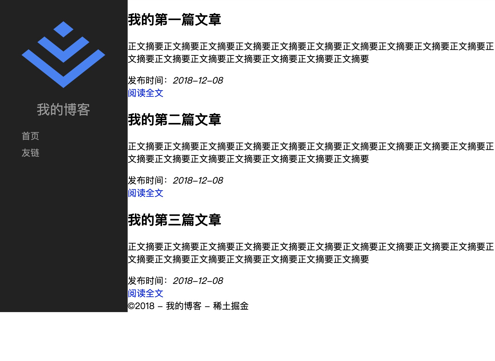
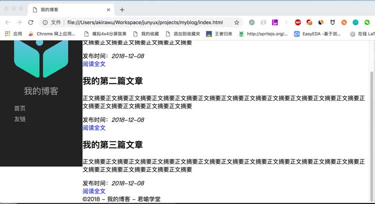
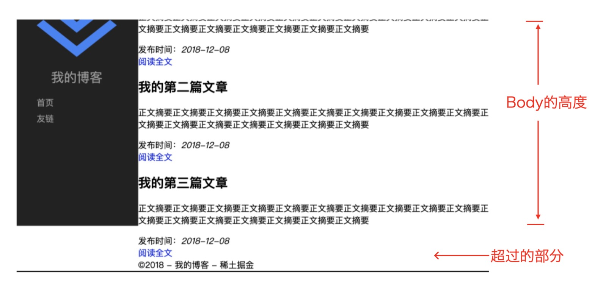
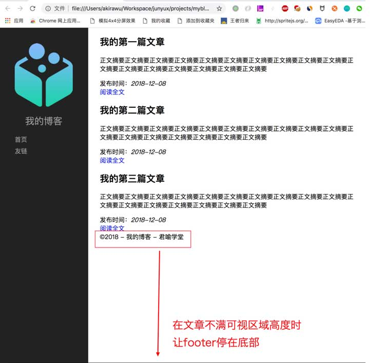
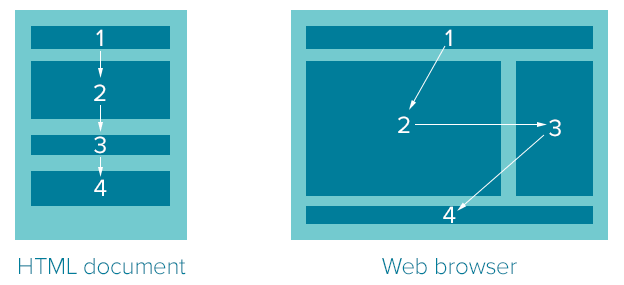
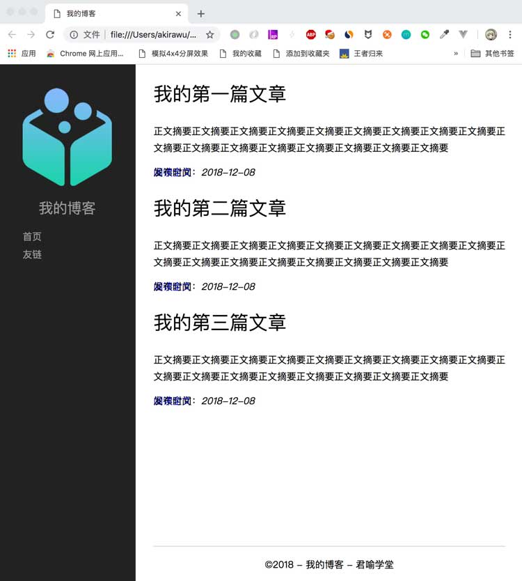

import {JCode} from '@/JCode'

# 布局和样式

首先，让我们回顾一下没有CSS的博客首页的呈现效果： 按照浏览器默认的文档流，从上到下， 从左到右排列。

<JCode codeId="7105203062603513863"/>

现在我们的任务是要通过CSS将它变成设计稿的样子：


对比实际网页和网页设计稿，我们发现， 这两个页面最大的不同在于它的布局不一样。HTML定义了网页的语义和结构， 但是无法自定义网页的布局。 这就需要通过CSS来实现了。

实现CSS布局是前端开发非常重要的能力，可以说是前端工程师还原设计稿、完成最终页面效果的基础技能。

根据产品不同特点（比如PC、移动端、响应式等）、浏览器环境（是否需要支持旧的浏览器，支持到什么样的版本）、网页内容结构（比如分栏、表格、瀑布流等）有各种不同的布局手段。

CSS的许多属性可以用来实现布局，大体上分为以下几类：

1. 浮动布局：使用CSS的浮动（float）属性来实现布局。
1. 弹性布局：使用CSS的弹性盒模型（flex box）相关属性来实现布局。
1. 网格布局：使用CSS的网格（grid）相关属性来实现布局。
1. 表格布局：使用CSS的表格（table）相关的属性来实现布局。
1. 绝对定位布局：使用CSS的绝对定位（absolute）相关的属性来实现布局。

以上布局方式各有利弊和适合使用的场景。在本课程里，我们不打算详细介绍每一种布局，我们先选择一种布局来实现我们的博客系统。在后续课程里，我们再慢慢接触和学习各种布局方式。

在一般的PC网页布局中，采用的主流方式一般是浮动布局，因为它的浏览器兼容性是最好的，如果你想要让你的网页在IE8甚至更早的版本中也能正常显示，那么通常要采用浮动布局。但是浮动布局涉及到的元素浮动（相关属性为CSS的float属性）规则还是比较复杂的，在我们前面的章节中并没有详细介绍，而且这是我们教程的第一课，为了简单起见，我们先学习弹性布局。

## 弹性布局（Flex Layout）

弹性布局是一种常用的网页布局方式，尤其是在设计移动端网页或能同时适配PC和移动端网页时使用更多。弹性布局的优缺点如下：

#### 优点

1. 规则简单、使用方便：只需掌握几个相关的CSS属性就能实现各种常见网页布局。
1. 内容弹性适应容器：能够灵活根据不同容器大小调整内容排列，天然适合实现能够适配不同设备终端的网页。

#### 缺点

1. IE9以及之前的版本不支持弹性布局。
1. 部分flex相关属性在一些较早的浏览器版本上未能完全实现。

接下来我们开始布局之旅，我们先在之前的index.html文件中的header标签里添加`<style>`元素，在其中添加几个样式


```html
<!DOCTYPE html>
<html>
<head>
  <meta charset="UTF-8">
  <title>我的博客</title>
  <style>
    html, body {
      padding: 0;
      margin: 0;
      min-width: 960px;
    }
  </style>
</head>
<body>
  <div id="main">
  ...
</body>
</html>
```

一开始，我们先添加一组基本样式：

```css
html, body {
  padding: 0;
  margin: 0;
  min-width: 800px;
}
```
将html和body元素的内外边距设置为零，目的是将网页的html和body元素默认的padding和margin覆盖掉，即消除内容区域和浏览器边界之间的空白。这是一种常见的做法，当一些元素的默认样式不适合我们的网页时，我们可以先将它们覆盖掉。

因为码上掘金的运行窗口默认比较窄（要给代码块出留空间），所以为了避免折行展示影响效果，我们给html和body元素设置一个最小宽度为`800px`。

接下来我们给body添加一个样式`display: flex`。

```css
html, body {
  padding: 0;
  margin: 0;
  min-width: 800px;
}
body {
  display: flex;
}
```

`display`是CSS的一个非常重要的属性。 它除了可以指定了元素的显示类型，比如：

- block 指定一个元素为块级元素；
- inline 指定一个元素为行内元素；
- inline-block 指定一个元素为行内块元素；
- none 指定一个元素在文档流中不可见；

还能够指定元素里子元素的布局方式。比如`display: flex` 指定了body元素里的子元素使用flex规则来排列。`flex`，表示body是弹性盒子。

现在我们的网页看上去变成这样：

<JCode codeId="7105254670339309576"/>

我们看到现在原本排列在下方的sidebar显示在右侧了。为什么现在body的直接子元素会按照横向排列，不再是原来的纵向排列了呢？这是因为flex属性改变了浏览器默认的文档流布局。我们回顾一下第三节课，浏览器默认的文档流布局是从上到下，从左到右的流式布局。当遇到行内元素或者行内块元素的时候，默认被安排在同一行，当一行排不下的时候，多出的元素会被安排在新的一行显示。当遇到块级元素时，浏览器总是腾出一行的空间来显示该元素。但是flex布局改变了这种默认的流式布局。flex不区分元素是否是块级元素还是行内元素。 默认情况， flex布局总是按照主轴方向，（默认为从左到右）安排各个元素。当且仅当一行排不下的时候，才会另起一行。

### flex主轴

flex布局沿着横向或者纵向安排元素， 这个排列方向被称为主轴。flex默认的主轴方向设置是`flex-direction: row`，即横向。主轴可以通过修改属性flex-direction来改变flex的主轴，比如改成纵向排列：

```css
body {
  display: flex;
  flex-direction: column;
}
```

这样就会让sidebar区域排列到main区域下方去，当然我们这里本来就是横向排列，没有必要修改这个值。

回到我们的项目，按我们的期望，应该是让sidebar显示在左侧。 但是，默认情况下， flex布局将sidebar安排在了右边。要实现让sidebar显示在左边，我们需要给main或sidebar的order属性做一下调整, 如下代码所示：

```css
html, body {
  padding: 0;
  margin: 0;
  min-width: 800px;
}
body {
  display: flex;
}
#main {
  order: 1;
}
```

现在sidebar就如预期那样显示在页面的左边。

<JCode codeId="7105255999237259294"/>

#### order属性

元素的order属性告诉flex布局按照元素的order属性指定的值，从小到大的顺序从左到右安排元素。默认情况下，元素sidebar的order值都是为0。因此，当我们把main元素的order设为1的时候，sidebar的默认order值是0， 所以main就被安排在sidebar的右侧了。当元素的order值相同的时候，flex布局按照元素的书写顺序沿主轴方向排列元素。

第5节课我们讲过CSS选择器，在这里我们补充一下前面课程中没有介绍过的一种选择器：ID选择器，用#号加上ID值来表示。因此`#main`就表示id为main的元素，在这里是`<div id="main">`这个元素。

ID选择器专用性要高于类选择器和伪类，当然也高于元素选择器，因此ID选择器的优先级要高于其他选择器。实际上ID选择器是CSS选择器中专用性最高的选择器。

好了，我们继续：

现在我们的侧边栏sidebar宽度是不固定的，现在比较窄。

我们给sidebar设置一个宽度，发现sidebar并没有如预期的变成230px宽。

```css
html, body {
  padding: 0;
  margin: 0;
  min-width: 800px;
}
body {
  display: flex;
}
#main {
  order: 1;
}
#sidebar {
  width: 230px;
}
```

<JCode codeId="7105256743025770510"/>

它之所以有这样的行为是因为flex布局在沿主轴方向排列元素的时候，如果空间不足，默认会收缩元素空间，导致看上去width属性没有达到预期效果。

#### flex-shrink属性

要取消收缩空间的效果，我们可以将sidebar的`flex-shrink`属性设置为0，flex-shrink属性为零是指定元素在主轴方向上不收缩。

```css
html, body {
  padding: 0;
  margin: 0;
  min-width: 800px;
}
body {
  display: flex;
}
#main {
  order: 1;
}
#sidebar {
  flex-shrink: 0;
  width: 230px;
}
```

<JCode codeId="7105258553555812389"/>

现在我们的sidebar有了固定的宽度230px。

`flex-shrink`有更复杂的用法，在这里我们先忽略，在后续课程中有相应使用场景时再详细解释。

## 局部样式

接下来，我们来处理profile容器里的布局，这个容器中包括博客头像和博客名称两部分。

首先，我们希望博客头像和名称都能在sidebar中居中显示，这个我们可以通过给profile元素一个`text-align: center`属性来实现。

另外我们给头像固定设置一个`150px`的宽度。

```css
html, body {
  padding: 0;
  margin: 0;
  min-width: 800px;
}
body {
  display: flex;
}
#main {
  order: 1;
}
#sidebar {
  flex-shrink: 0;
  width: 230px;
}
#profile {
  text-align: center;
}
#avatar img {
  width: 150px;
}
```

<JCode codeId="7105259180985942029"/>

profile元素中的头像显示位置在页面顶部，这个位置太高了，我们可以给profile设置一个padding-top。 这里我们给profile元素定义了一个40px的上内边距, 使图片不是置顶显示。

```css
html, body {
  padding: 0;
  margin: 0;
  min-width: 800px;
}
body {
  display: flex;
}
#main {
  order: 1;
}
#sidebar {
  flex-shrink: 0;
  width: 230px;
}
#profile {
  text-align: center;
  padding-top: 40px;
}
#avatar img {
  width: 150px;
}
```

我们可以将h1的文字大小设置小一些，并取消加粗，以显得标题不那么突兀：

```css
html, body {
  padding: 0;
  margin: 0;
  min-width: 800px;
}
body {
  display: flex;
}
#main {
  order: 1;
}
#sidebar {
  flex-shrink: 0;
  width: 230px;
}
#profile {
  text-align: center;
  padding-top: 40px;
}
#profile h1 {
  font-size: 1.5rem;
  font-weight: normal;
}
#avatar img {
  width: 150px;
}
```

h1标题默认的字体大小是2rem，在这里我们将它设置成1.5rem，让它变小一些。和px一样，rem是一个单位，在本课程里，我们先不去具体解释它，在后续课程中我们会详细解释rem和其他的一些CSS计量单位。

font-weight设为normal，可以让h1字体看起来是正常而不是粗体。

现在我们的网页看起来如下：

<JCode codeId="7105259808785170439"/>

处理好profile，接下来我们要处理navigator的部分:

我们先给navigator中的链接设置一下padding-left（左内边距）和行高，让它们看起来舒服一点：

```css
html, body {
  padding: 0;
  margin: 0;
  min-width: 800px;
}
body {
  display: flex;
}
#main {
  order: 1;
}
#sidebar {
  flex-shrink: 0;
  width: 230px;
}
#profile {
  text-align: center;
  padding-top: 40px;
}
#profile h1 {
  font-size: 1.5rem;
}
#avatar img {
  width: 150px;
}
#navigator {
  padding-left: 40px;
  line-height: 30px;      
}
```

我们不喜欢链接的下划线，汉字的链接下划线看起来一点都不美观，幸好我们可以设置a标签的text-decoration属性，将它设置为none，就可以不显示链接下划线：

```css
html, body {
  padding: 0;
  margin: 0;
  min-width: 800px;
}
body {
  display: flex;
}
a {
  text-decoration: none;
}
#main {
  order: 1;
}
#sidebar {
  flex-shrink: 0;
  width: 230px;
}
#profile {
  text-align: center;
  padding-top: 40px;
}
#profile h1 {
  font-size: 1.5rem;
}
#avatar img {
  width: 150px;
}
#navigator {
  padding-left: 40px;
  line-height: 30px;      
}
```

注意text-decoration属性是不可继承属性，所以必须要设置在a标签上，不能设置在它的父容器上。我们希望取消所有的a标签的下划线，所以直接添加了一个元素选择器a上的属性。

去掉链接下划线，页面看起来更清楚一些，但是也带来一个问题，就是链接的状态不是很明显，但是别急，我们接下来一步步解决问题。

现在页面变成这样：

<JCode codeId="7105260283211448327"/>

页面效果一步步朝着我们的期望靠近。

接下来，我们给整个sidebar设置一下背景色和字体颜色：

```css
html, body {
  padding: 0;
  margin: 0;
  min-width: 800px;
}
body {
  display: flex;
}
a {
  text-decoration: none;
}
#main {
  order: 1;
}
#sidebar {
  flex-shrink: 0;
  width: 230px;
  background-color: #222;
  color: #999;
}
#sidebar a {
  color: #999;
}
#profile {
  text-align: center;
  padding-top: 40px;
}
#profile h1 {
  font-size: 1.5rem;
  font-weight: normal;
}
#avatar img {
  width: 150px;
}
#navigator {
  padding-left: 40px;
  line-height: 30px;      
}
```

注意我们需要分别设置sidebar和sidebar中的a元素的字体颜色，理由我们在第5节已经给大家简单说明过，链接a元素的颜色被浏览器特殊设置过，因此在这里也需要重新设置一下。

### RGB 色值

在这里，我们注意到`#sidebar`和`#sidebar a`里，color被设置为`#222`和`#999`这样的值，这两个值其实是缩写，分别表示`#222222`和`#999999`。

以符号`#`加上六位数字0-9或A-F值表示的颜色为RGB颜色，这是CSS中颜色的一种常见表示法。这种颜色表示法用3个两位十六进制数来分别表示三原色红（R）、绿（G）、蓝（B）的色值，00为最小值，FF（即十进制255）为最大值，所以，`#FF0000`表示红色，`#0000FF`表示蓝色，`#000000`表示黑色，`#FFFFFF`表示白色。

其中CSS规定，如果表示颜色的两位色值数字相同，又可以进行简写，所以`#AABBCC`可以简写为`#ABC`，红色可以简写为`#F00`，蓝色可以简写为`#00F`，黑色可以简写为`#000`，白色可以简写为`#FFF`。

CSS颜色除了我们前面见过的用单词`black`、`blue`这样的表示法，和RGB色值表示法外，还有其他好几种表示法，在这里我们不做详细解说，等后续课程中有涉及相关内容时，再进行详细的说明。

有兴趣的同学可以详细阅读[MDN](https://developer.mozilla.org/zh-CN/docs/Web/CSS/color_value)的关于css-color的部分。

### 底部空白

当页面高度较小时，我们发现一个问题。网页变成这样，底部出现空白：



---

我们希望sidebar能够占满整个左侧区域，而不是留下一个空白。这个空白存在的原因是，flex布局主轴上的元素默认会被对齐高度。因为无论是sidebar还是main的高度都没有达到整个页面的高度，所以底部就留下了空白区域。为了避免这个问题，我们可以给`html`和`body`元素设置高度为`100%`。

最终的效果如下，这样我们就设置好了Sidebar。

<JCode codeId="7105261025360314381"/>

这时， 网页看上去似乎没有问题，页面与浏览器底部之间的空白不见了。但是这样真的解决问题了吗？实际上并没有。

如果我们把浏览器高度调小一些，看看会发生什么事情。

我们发现，当浏览器高度比内容高度小的时候，出现了滚动条，而将滚动条往下滚动时，左侧边栏底部又出现了空白。



为什么会这样呢？

原来，根据HTML规范，当我们给一个元素固定高度时，如果它的内容超过元素盒子的高度，默认情况下内容会**溢出**元素边界显示。

我们把html和body的高度设为了100%，这样body的实际高度就是浏览器窗口可视区的高度。现在body内的实际内容（即主区域的文字）超过了窗口实际的高度。因此，当我们向下滚动时，我们看到的内容实际上是超过body高度溢出的内容，然而背景颜色并不会跟随着溢出，因此我们就看到滚动之后，侧边栏跟随着溢出内容多出来的高度里没有了背景。



所以，这种情况下，不考虑内容可能溢出，将body设置为固定的100%是错误的。我们应该把body的min-height而不是height设置为100%，这样才能解决溢出问题。

```css
html, body {
  padding: 0;
  margin: 0;
  min-width: 800px;
}
html {
  height: 100%;
}
body {
  min-height: 100%;
  display: flex;
}
```

<JCode codeId="7105265141293580302"/>

由于用户使用的设备各式各样，CSS中有一些能够适应弹性设备的设计，比如属性值可以百分比单位，不设置宽高的元素可以根据内容自动计算宽高，另外还有max-width、max-height、min-width、min-height这样更灵活的设计。

```css
html {
  height: 100%;
}
body {
  min-height: 100%;
}
```

这样的CSS组合指定html的高度为当前可视区大小，而body的最小高度为当前可视区域大小，因此当body的内容高度小于当前可视区大小时，body的高度设为等于当前可视区大小，而当内容高度大于当前可视区大小时，body高度将等于实际内容高度。

## 文章区和页脚

现在我们解决了内容高度问题，我们接下来要做两件事情，首先是文章和侧栏之间要有一些空白。

```css
html, body {
  padding: 0;
  margin: 0;
  min-width: 800px;
}
html {
  height: 100%;
}
body {
  min-height: 100%;
  display: flex;
}
#main {
  order: 1;
  padding: 0 30px;
}
```

我们将main属性的padding设置为`0 30px`，这是一种简写，相当于`padding: 0 30px 0 30px`。在前面我们提到过，这里再复习一下，padding的设置顺序是top->right->bottom->left，所以我们把main区域的左右各留有30px的空白。

接下来我们希望footer内容出现在底部区域，这里包含两个含义：
- 当文章内容小于可视区高度时，我们希望footer内容在可视区底部
- 当文章内容大于可视区高度时，我们希望footer内容在最后一篇文章摘要下方



要实现这个效果，有好几种做法，不过我们这次既然采用弹性布局的方式，所以我们继续采用弹性布局的做法。我们针对主区域使用一个嵌套的弹性布局，在这么做之前，我们先稍微修改一下网页结构，给网页中的`<article>`元素外部增加一个容器，我们使用一个`<section>`元素。

section是一个**语义化标签**，表示一个内容块。

```html
<!--文章区-->
<section>
  <article>
    <h2>我的第一篇文章</h2>
    <p>正文摘要正文摘要正文摘要正文摘要正文摘要正文摘要正文摘要正文摘要正文摘要正文摘要正文摘要正文摘要正文摘要正文摘要正文摘要正文摘要正文摘要</p>
    <div class="pubtime">发布时间：<em>2018-12-08</em></div>
    <div class="readmore"><a href="articles/01.html">阅读全文</a></div>
  </article>
  <article>
    <h2>我的第二篇文章</h2>
    <p>正文摘要正文摘要正文摘要正文摘要正文摘要正文摘要正文摘要正文摘要正文摘要正文摘要正文摘要正文摘要正文摘要正文摘要正文摘要正文摘要正文摘要</p>
    <div class="pubtime">发布时间：<em>2018-12-08</em></div>
    <div class="readmore"><a href="articles/01.html">阅读全文</a></div>
  </article>
  <article>
    <h2>我的第三篇文章</h2>
    <p>正文摘要正文摘要正文摘要正文摘要正文摘要正文摘要正文摘要正文摘要正文摘要正文摘要正文摘要正文摘要正文摘要正文摘要正文摘要正文摘要正文摘要</p>
    <div class="pubtime">发布时间：<em>2018-12-08</em></div>
    <div class="readmore"><a href="articles/01.html">阅读全文</a></div>
  </article>
</section>
```

?> 注意，在我们用HTML组织网页结构的时候，我们采用简化原则，使用最简的标签表示结构，不添加多余的标签。而在使用CSS实现样式布局的时候，我们可根据需要在一些元素外层添加容器元素，以方便布局。

接下来我们将main元素的display也设置为flex，由于主区域是垂直布局，所以主轴方向和body的不同，应该将flex-direction属性设为column。

```css
html, body {
  padding: 0;
  margin: 0;
  min-width: 800px;
}
html {
  height: 100%;
}
body {
  min-height: 100%;
  display: flex;
}
#main {
  order: 1;
  padding: 0 30px;
  display: flex;
  flex-direction: column;
}
```

#### flex-grow属性

接下来，我们给section设置一个属性叫`flex-grow`，与上一节课的`flex-shrink`属性相反，`flex-grow`属性定义当主轴有多余空间时，空间如何分配，默认值为0，表示不分配多余空间。这里我们将section的`flex-grow`设为1，由于footer的`flex-grow`仍然是0，所以多余空间将被section完全占去，这样footer就会落到可视区底部了。

```css
html, body {
  padding: 0;
  margin: 0;
  min-width: 800px;
}
html {
  height: 100%;
}
body {
  min-height: 100%;
  display: flex;
}
#main {
  order: 1;
  padding: 0 30px;
  display: flex;
  flex-direction: column;
}
section {
  flex-grow: 1;
}
```

与flex-shrink一样，flex-grow也有更复杂的用法，在这里我们也先忽略，在后续课程中有相应使用场景时再详细解释。

这是现在我们网页看上去的样子：

<JCode codeId="7105271564194545678"/>

接下来，我们给footer设置一些样式：

```css
html, body {
  padding: 0;
  margin: 0;
  min-width: 800px;
}
html {
  height: 100%;
}
body {
  min-height: 100%;
  display: flex;
}
#main {
  order: 1;
  padding: 0 30px;
  display: flex;
  flex-direction: column;
}
section {
  flex-grow: 1;
}
footer {
  text-align: center;
  line-height: 60px;
  border-top: solid 1px #ccc;
  margin-top: 20px;
}
```

这里我们让footer的文字居中显示，并给它设置一个合适的行高，以使得它的文字上下留有空白，最后，我们给它加一个border-top，设置为实线，颜色值为 #ccc。

现在我们的网页底部好看多了。

<JCode codeId="7105273510779420679"/>

### 文章列表

接下来我们要处理文章列表部分了。

我们先处理标题，修改文字大小和粗细：

```css
section {
  flex-grow: 1;
}
section h2 {
  font-size: 2rem;
  font-weight: normal;
}
```

段落摘要的文字间距看上去有点拥挤，我们给段落摘要设置一个180%的行间距：（即，文字高度的1.8倍）

```css
section {
  flex-grow: 1;
}
section h2 {
  font-size: 2rem;
  font-weight: normal;
}
section p {
  line-height: 180%;
}
```

现在看起来清爽多了：

<JCode codeId="7105274235341242399"/>

接下来我们处理发布时间和阅读全文的样式。

我们希望按照我们的原型图，将发布时间的信息挪到每篇文章的右上角，这里我们可以用一个定位技巧。


## 脱离文档流


### 文档流

在HTML文档中，默认情况下元素的位置根据它前面正常渲染的元素位置进行计算。我们前面说过元素常见类型分为块级元素（block element）、行内元素（inline element）、行内块元素（inline-block element）等，除了特殊的比如前面的flex规则外，HTML文档将元素根据这些类型**从上到下**、**从左到右**地排布，我们把文档将默认元素一一排开的过程形象地想象成一种流体，于是就把这个称之为**文档流**。



在文档流中，元素各自占据一块空间，而后按照不同的类型依次排列，不会出现重叠的情况。

如果我们让文档中的某个元素不遵循排列规则，脱离出来，出现在其他位置或与其他元素重叠，则称将该元素**脱离文档流**。

我们刚学习过的flex相关的属性，会让元素以非默认的方式进行排列，这些排列与默认排列不同，但自成规则，不属于脱离文档流，我们将这些元素的排列方式称为特殊文档流。

在CSS中，设置某些属性能够让元素脱离文档流。默认情况下，发布时间信息处于文档流内，按照规则`<div class="pubtime">发布时间：<em>2018-12-08</em></div>`显示在摘要段落`<p>`标签之后的位置，现在我们可以给它设置一个`position: absolute`属性将它脱离出文档流：

```css
section {
  flex-grow: 1;
  padding-bottom: 30px;
}
section h2 {
  font-size: 2rem;
  font-weight: normal;
}
section p {
  line-height: 180%;
}
.pubtime {
  position: absolute;
}
```

现在我们看到，每篇文章的发布时间那段文字和阅读全文的链接重叠在一起，这是因为我们将发布时间元素的position属性设置为absolute会引起它**脱离文档流**。



### position属性

接下来我们就可以调整发布时间的位置了，要如何调整呢？我们就需要了解一下positon这个属性。

元素的position属性决定一个元素在文档中的定位方式，它有以下几个可取的值：

- static 元素使用正常定位，即处于文档流中的默认位置。
- relative 元素先处于文档流中的默认位置，再根据top、left、right、bottom等属性指定元素相对于默认位置的偏移。
- absolute 不为元素预留空间，再根据top、left、right、bottom等属性指定元素**相对于最近的非static定位的祖先元素**的偏移。
- fixed 不为元素预留空间，而是通过指定元素**相对于屏幕视口**（viewport）的位置来指定元素位置。

将postion设为absolute或fixed，都会使得元素脱离文档流。

接下来，我们需要将发布时间调整到每篇文章的右上角。因此pubtime元素的参考的祖先元素是article元素。根据规范，被指定为absolute的元素是相对于最近的非static定位的祖先元素偏移的。所以我们需要将article元素的position属性设置为relative, 使得article元素成为pubtime元素的参考元素。

```css
section {
  flex-grow: 1;
  padding-bottom: 30px;
}
section h2 {
  font-size: 2rem;
  font-weight: normal;
}
section p {
  line-height: 180%;
}
article {
  position: relative;
}
.pubtime {
  position: absolute;
  top: 20px;
  right: 20px;
}
```

我们将article的position设置为relative，将.pubtime的position设置为absolute并给它设置top和right属性，这样就使得.pubtime元素相对于article的右上角进行定位，最后的效果如图：

<JCode codeId="7105274866491883551"/>

至此我们的博客首页基本完成，让我们最后再做一些优化：

```css
section {
  flex-grow: 1;
  padding-bottom: 30px;
}
section h2 {
  font-size: 2rem;
  font-weight: normal;
}
section p {
  line-height: 180%;
}
article {
  position: relative;
  padding-bottom: 30px;
  border-bottom: solid 1px #ccc;
}
.pubtime {
  position: absolute;
  top: 20px;
  right: 20px;
}
```

我们给article元素设置一个padding-bottom和一个border-bottom，这样使得文章之间留有空隙和间隔，看起来不那么拥挤。

一般来说，用户不论点文章标题还是阅读全文都应该跳转到文章详情页，因此我们再修改一下HTML，给文章标题h2元素内的文字也加一下链接：

```html
<!--文章区-->
<section>
  <article>
    <h2><a href="articles/01.html">我的第一篇文章</a></h2>
    <p>正文摘要正文摘要正文摘要正文摘要正文摘要正文摘要正文摘要正文摘要正文摘要正文摘要正文摘要正文摘要正文摘要正文摘要正文摘要正文摘要正文摘要</p>
    <div class="pubtime">发布时间：<em>2018-12-08</em></div>
    <div class="readmore"><a href="articles/01.html">阅读全文</a></div>
  </article>
  <article>
    <h2><a href="articles/02.html">我的第二篇文章</a></h2>
    <p>正文摘要正文摘要正文摘要正文摘要正文摘要正文摘要正文摘要正文摘要正文摘要正文摘要正文摘要正文摘要正文摘要正文摘要正文摘要正文摘要正文摘要</p>
    <div class="pubtime">发布时间：<em>2018-12-08</em></div>
    <div class="readmore"><a href="articles/01.html">阅读全文</a></div>
  </article>
  <article>
    <h2><a href="articles/03.html">我的第三篇文章</a></h2>
    <p>正文摘要正文摘要正文摘要正文摘要正文摘要正文摘要正文摘要正文摘要正文摘要正文摘要正文摘要正文摘要正文摘要正文摘要正文摘要正文摘要正文摘要</p>
    <div class="pubtime">发布时间：<em>2018-12-08</em></div>
    <div class="readmore"><a href="articles/01.html">阅读全文</a></div>
  </article>
</section>
```

这样我们要给文章标题的a链接重新设置一下文字颜色：

```css
article a {
  color: #333;
}
```

最后一篇文章不需要`border-bottom`，因为`footer`已经有`border-top`，可以用`last-child`伪类选择器将`border-bottom`去掉

```css
article:last-child {
  border-bottom: none;
}
```

自此，我们的博客首页基本上就完成了。

<JCode codeId="7105275915407458318"/>

当然，我们还有一些细节可以进一步思考，比如，我们设置了`html`和`body`最小宽度为`800px`，这避免了当浏览器窗口宽度过小的时候，文章标题和右侧的发布时间重叠，但它也会带来弊端，那就是在屏幕比较窄的移动端设备上，网页显示可能会出现横向的滚动条。

实际上，现在我们的博客是为PC和平板宽屏设计的，并没有考虑窄屏的移动设备。

像这样的问题，在前端开发中比较常见，我们通常在项目中需要考虑用户用什么样的终端来访问我们的网站，以及当我们的内容在一些特殊的情况下（比如标题很短/很长、摘要很少/很多，文章很少/很多时），网页会呈现什么样的效果。

另外，我们可能还需要考虑网页的可用性（accessiblity），比如考虑视觉障碍人士如何正常访问我们的网页等等，这是另外一个话题。

不过不着急，在我们后续的课程中，我们会涉及到这些问题，并有机会进一步优化我们的博客网站。

现在我们稍作总结，之后我们将进入一个新的话题，在初步掌握了HTML、CSS之后，再初步接触一门新的编程语言——JavaScript。

## 小结

通过这节课，我们可以看到，在实现一个网页原型时， 首先根据设计稿把网页分为若干个主要部分，然后再分析和定义每一个部分的子布局，最后在定义每一个细节：比如字体， 颜色，行间距，内外边距等等。

在这一讲中， 我们还学习了：

- flex（弹性布局）以及它相关属性的应用。
  - 它的优缺点是：
    - 优点：规则简单、使用方便，内容能随着容器大小弹性排列。
    - 缺点：早期浏览器不兼容。
- height和min-height各自的用处和特点；
- 默认文档流： 是按照元素的类型，从上到下， 从左到右排列；
- 以及设置position属性使得元素脱离文档流。 