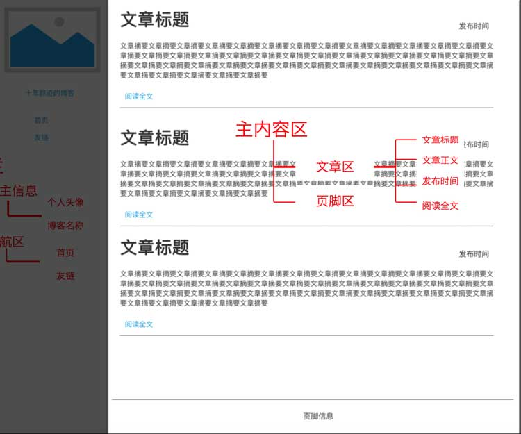
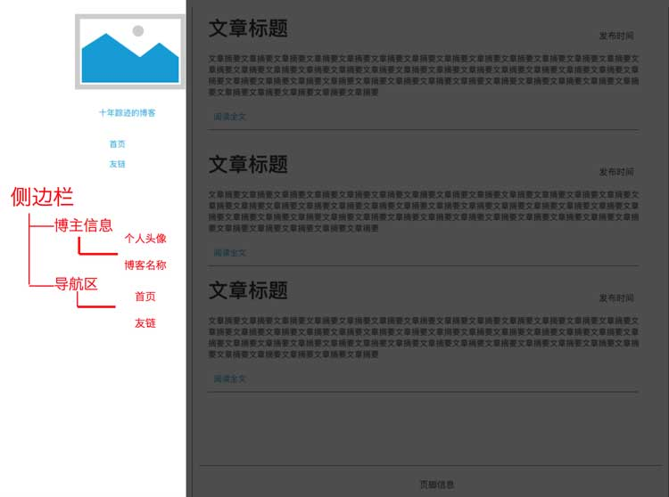

import {JCode} from '@/JCode'

# 用HTML组织博客内容

## 元素的类型

首先，我们先回顾一下上一节课里的例子， 它的页面结构如下图所示：

```bash
html
├── head
│   ├── meta
│   └── title
└── body
    ├── h1
    ├── img
    ├── p
    │   └── em
    ├── h2
    └── p
        └── a
```

HTML元素有不同的类型，大体上，HTML元素分为**呈现元素**和**非呈现元素**，其中非呈现元素不会被浏览器渲染内容到网页中。呈现元素依据浏览器渲染方式呈现不同的形态，又可进一步分为**块级元素**和**行内元素**。

我们先来看一下head中的元素：

`<meta charset="UTF-8">`指定网页的字符编码为UTF-8。

`<title>我的第一个网页</title>`指定网页的标题，浏览器一般将它的内容显示在地址栏下方的标签栏里。

meta和title元素都不直接在网页中呈现内容，是非呈现元素。

在body中的h1、h2、p、a、em和img都是呈现元素，但是它们的呈现方式也有区别。其中h1、h2和p不论内容多少都会占据一整行的空间，它们被称为**块级元素（block element）**。a和em不占据整行的空间，它们被称为**行内元素（inline element）**。img是一个特殊的标签，它不占据整行的空间，但是它又有些特别之处，因此它不属于行内元素，而是另外一种叫做**行内块元素（inline-block element）**。我们后面的课程中介绍CSS的时候还会有详细的说明。

行内元素可以和其他行内元素或文本内容显示在同一行。块级元素总是占据整行的空间，因此如果在它的前后有文本内容或者有行内元素，内容会被切分为多行：

```html
<div>
  我是文本内容<div>我是块级元素</div>我是文本内容
</div>
<div>
  我是文本内容<span>我是行内元素</span><div>我是块级元素</div>我是文本内容
</div>
```

最终渲染出来效果是：

<JCode codeId="7105198154555129886"/>

!> 在这里我们认识两个新的元素，div是一个块级元素，而span是一个行内元素。div和span是两个常用标签，在课程后续的例子中我们还会大量使用到它们。

从上面的例子我们可以看到，行内元素和行内元素， 文本内容和文本内容，或者行内元素和文本内容都能显示在同一行。但是，块级元素总是会另起一行并占据整行空间。

## 如何组织文档结构

我们前面学了基本的行内元素和块级元素的概念，我们需要了解，行内元素和块级元素不仅仅是呈现方式的区别，在组织结构上，通常我们**允许块级元素嵌套块级元素或行内元素，但不允许行内元素嵌套块级元素**。换句话说，块级元素的标签可以嵌套块级和非块级元素，行内元素的标签中只允许嵌套非块级元素。这是组织HTML文档结构的基本原则。

### 定义结构

通常意义上来说，HTML负责定义文档结构，我们后面会学到的CSS负责定义内容展现形式，二者**职责分离**。那么HTML如何定义文档结构呢？我们还是通过例子来学习。

让我们回过头看一下第2节的个人博客首页原型图：


一个典型的网页由页面结构和图文内容共同构成。我们把它**自顶而下**来分析结构：

首先，我们设计的博客首页是一个典型的左右分栏结构，整体结构包括页面主体部分的主题内容区域和页面左侧的侧边栏区域，所以第一步我们先划分整体结构：

```html
<body>
  <div id="main"></div>
  <div id="sidebar"></div>
</body>
```

在这里我们用两个div来分别承载页面主体和边栏，给它们指定不同的id属性，分别为main和sidebar，以便区分它们。

!> 我们在后面的课程中会了解到，设置元素的id属性，除了区分元素之外，还可以作为检索元素和设置元素样式的选择器。

接下来我们将分别往`<div id="main">`和`<div id="sidebar">`中添加各自的内容。这两个div作为承载内容的元素，又被称为**容器**。在HTML页面结构中，通常我们将**块级元素**作为承载内容的容器使用。

在继续之前，有一点要特别注意，在构造整体结构的时候，我将`<div id="sidebar">`标签放在`<div id="main">`之后而不是之前。我是有意这么做的。

虽然我们的阅读顺序通常是从上到下，从左到右，但是我们在设计HTML结构的时候，可以采用“主->次”的思路，通常这优于“左->右”的思路。这是因为虽然我们这次的博客页面采用侧栏在主区域左侧的风格，但是有些博客主喜欢把侧栏放在主区域右侧，我们不排除未来修改博客风格，将侧栏调整到其他位置，所以通常情况下，以“主->次”划分比以“左->右划分更加通用”（这也是为什么我们把结构划分为主区域和侧边栏，而不是左边栏和右区域）。而且，由于**浏览器对HTML文档的解析是文件内容从上到下依次解析，将主区域放在前面能使得网页上的主体内容被优先解析和呈现**。

好了，让我们继续：

主内容区分为文章区和页脚区两块。文章区是陈列文章的区域，页脚是显示版权声明等附加内容的区域。文章我们以块级元素`<article>`来表示，页脚我们以块级元素`<footer>`来表示。 如下图所示：



```html
<body>
  <div id="main">
    <!--文章区-->
    <article></article>
    <article></article>
    <article></article>
    <!--列表区-->
    <footer></footer>
  </div>
  <div id="sidebar"></div>
</body>
```

在HTML里，以`<!--`和`-->`包裹的内容是注释，浏览器在解析网页的时候会忽略其中的内容，我们开发者在构建复杂页面的时候，可以通过撰写注释来使得页面结构更容易被人理解，变得易于维护。

现在我们建立了表示三篇文章的`<article>`元素和表示页脚的`<footer>`元素，接下来我们继续往里面填充内容。

每篇文章中包括标题、正文摘要、发布时间和阅读全文，可以分别用h2、p、div、div来表示。

```html
<article>
  <h2>我的第一篇文章</h2>
  <p>正文摘要正文摘要正文摘要正文摘要正文摘要正文摘要正文摘要正文摘要正文摘要正文摘要正文摘要正文摘要正文摘要正文摘要正文摘要正文摘要正文摘要</p>
  <div class="pubtime">发布时间：<em>2018-12-08</em></div>
  <div class="readmore"><a href="articles/01.html">阅读全文</a></div>
</article>
```

在这里，我们用`class="pubtime"`和`class="readmore"`来区分发布时间和阅读全文两处内容。不同于前面使用id属性，这里我们使用了class属性。这是因为，id属性是用来标识页面上唯一元素的，一个页面上只有一个主体区容器和一个侧边栏容器，它们都是唯一的，所以用id来区分，而每篇文章都有一个发布时间和一个阅读全文元素，所以它们在页面上不唯一，就用class来区分。

!> 与id一样，class除了区分元素，也是重要的选择器，在后续课程中我们会深入介绍。

我们在发布时间和阅读全文中使用了两个行内元素em和a，em标签告诉浏览器其中的文本内容需要强调，浏览器默认会以斜体字来显示，以示与其他内容区别。a标签我们前面学过，它定义链接，让浏览器在用户点击阅读全文时，跳转到href属性指定的URL去。

通过上面实践，我们看到，**当构造HTML结构的时候，通常块级元素负责组织内容，行内元素通常负责修饰内容**。

接下来，我们继续添加`<footer>`里的内容，主要是版权信息，比较简单：

```html
<footer>
  &copy;2018 - 我的博客 - 稀土掘金
</footer>
```

至此我们完成了主内容区的完整结构：

```html
<body>
  <div id="main">
    <!--文章区-->
    <article>
      <h2>我的第一篇文章</h2>
      <p>正文摘要正文摘要正文摘要正文摘要正文摘要正文摘要正文摘要正文摘要正文摘要正文摘要正文摘要正文摘要正文摘要正文摘要正文摘要正文摘要正文摘要</p>
      <div class="pubtime">发布时间：<em>2018-12-08</em></div>
      <div class="readmore"><a href="articles/01.html">阅读全文</a></div>
    </article>
    <article>
      <h2>我的第二篇文章</h2>
      <p>正文摘要正文摘要正文摘要正文摘要正文摘要正文摘要正文摘要正文摘要正文摘要正文摘要正文摘要正文摘要正文摘要正文摘要正文摘要正文摘要正文摘要</p>
      <div class="pubtime">发布时间：<em>2018-12-08</em></div>
      <div class="readmore"><a href="articles/01.html">阅读全文</a></div>
    </article>
    <article>
      <h2>我的第三篇文章</h2>
      <p>正文摘要正文摘要正文摘要正文摘要正文摘要正文摘要正文摘要正文摘要正文摘要正文摘要正文摘要正文摘要正文摘要正文摘要正文摘要正文摘要正文摘要</p>
      <div class="pubtime">发布时间：<em>2018-12-08</em></div>
      <div class="readmore"><a href="articles/01.html">阅读全文</a></div>
    </article>
    <!--列表区-->
    <footer>
      &copy;2018 - 我的博客 - 稀土掘金
    </footer>
  </div>
  <div id="sidebar"></div>
</body>
```

接下来，我们继续完成侧边栏区域。侧边栏包含博主信息和导航区，它的页面效果如下图：



```html
<div id="sidebar">
  <div id="profile"></div>
  <div id="navigator"></div>
</div>
```

博主信息包括头像和博客名称：

```html
<div id="sidebar">
  <div id="profile">
    <div id="avatar">
      <a href="about.html"></a>
    </div>
    <h1>我的博客</h1>
  </div>
  <div id="navigator"></div>
</div>
```

因为博客名称可以看做是整个首页的主标题，所以我们用h1标签表示。头像是一个带链接的图片，链接是a标签，里边的图片是img标签。我们前面说过，a链接是一个**行内元素**，当行内元素和一个块级元素（这里是h1）并列的时候，我们在它外层套一个块级元素div，给它`id="avatar"`属性作为标识。

**注意，当一个非块级元素和其他块级元素并列时，我们通常给这个非块级元素外层套一个块级元素。**

接下来是最后的导航区，这其中只有两个链接，结构比较简单：

```html
<div id="sidebar">
  <div id="profile">
    <div id="avatar">
      <a href="about.html"></a>
    </div>
    <h1>我的博客</h1>
  </div>
  <div id="navigator">
    <div><a href="index.html">首页</a></div>
    <div><a href="friend.html">友链</a></div>
  </div>
</div>
```

首页和友链是两个链接，用两个a标签，但是因为a标签是行内元素，而我们希望两个链接分别显示在不同的行，所以在它们外边分别套一个块级元素div。

最后，别忘了head里的标签：

```html
<head>
  <meta charset="UTF-8">
  <title>我的博客</title>
</head>
```

至此，我们将完整页面构造出来了：

```html
<!DOCTYPE html>
<html>
<head>
  <meta charset="UTF-8">
  <title>我的博客</title>
</head>
<body>
  <div id="main">
    <!--文章区-->
    <article>
      <h2>我的第一篇文章</h2>
      <p>正文摘要正文摘要正文摘要正文摘要正文摘要正文摘要正文摘要正文摘要正文摘要正文摘要正文摘要正文摘要正文摘要正文摘要正文摘要正文摘要正文摘要</p>
      <div class="pubtime">发布时间：<em>2018-12-08</em></div>
      <div class="readmore"><a href="articles/01.html">阅读全文</a></div>
    </article>
    <article>
      <h2>我的第二篇文章</h2>
      <p>正文摘要正文摘要正文摘要正文摘要正文摘要正文摘要正文摘要正文摘要正文摘要正文摘要正文摘要正文摘要正文摘要正文摘要正文摘要正文摘要正文摘要</p>
      <div class="pubtime">发布时间：<em>2018-12-08</em></div>
      <div class="readmore"><a href="articles/01.html">阅读全文</a></div>
    </article>
    <article>
      <h2>我的第三篇文章</h2>
      <p>正文摘要正文摘要正文摘要正文摘要正文摘要正文摘要正文摘要正文摘要正文摘要正文摘要正文摘要正文摘要正文摘要正文摘要正文摘要正文摘要正文摘要</p>
      <div class="pubtime">发布时间：<em>2018-12-08</em></div>
      <div class="readmore"><a href="articles/01.html">阅读全文</a></div>
    </article>
    <!--列表区-->
    <footer>
      &copy;2018 - 我的博客 - 稀土掘金
    </footer>
  </div>
  <div id="sidebar">
    <div id="profile">
      <div id="avatar">
        <a href="about.html"></a>
      </div>
      <h1>我的博客</h1>
    </div>
    <div id="navigator">
      <div><a href="index.html">首页</a></div>
      <div><a href="friend.html">友链</a></div>
    </div>
  </div>
</body>
</html>
```

我们把代码放在[码上掘金](https://code.juejin.cn)，现在整个网页看起来类似下面这样：

<JCode codeId="7105203062603513863"/>

至此， 我们已经使用HTML完整定义了我们的博客首页结构。 但是，这个页面看起来和我们的设计稿有很大的差别。这是因为浏览器解析标签语意后，它会按照默认的文档流布局和呈现不同标签的内容。 

那么什么是浏览器默认的文档流呢？浏览器默认的文档流布局是从上到下，从左到右的流式布局。当遇到行内元素或者行内块元素的时候，默认被安排在同一行，当一行排不下的时候，多出的元素会被安排在新的一行显示。当遇到块级元素时，浏览器总是腾出一行的空间来显示该元素。 在后续的课程中， 你们将会学习如何让网页按照设计稿的样子呈现。目前， 先让我们总结一下这节课的内容。

到目前为止，我们一共接触到了14个不同标签，分别是：

- html, head, body 标签
- title, meta 标签
- h1, h2, div, p, article, footer 标签
- a, em, span 标签
- img 标签

这些标签分别表示呈现元素、非呈现元素、块级元素、行内元素、行内块元素。那么问题是，为什么HTML有那么多我们需要学习的不同标签？h1、h2、div、p、article, footer几种块级元素标签为什么不可以统一用div？em、span标签为什么不可以统一用span？

要回答这个问题，我们需要理解并接受一个**重要原则**，那就是：

?> **HTML标签（元素）是具有语义的，使用正确语义标签书写HTML，是基本原则**。

HTML标签的语义，是指标签本身的符号所表示的含义，比如h1表示一级标题，h2表示二级标题，p表示段落，article表示文章，footer表示页脚，a表示链接，img表示图片。这些语义，不仅仅是针对书写和阅读HTML文档的人的，也是针对浏览器、读屏软件、搜索引擎蜘蛛和其他第三方工具的。比如作为链接的a，不仅仅在浏览器上呈现不同的颜色和行为，也能被读屏软件正确识别，从而使视觉障碍人士能够正常使用。h1、h2等标签也是同样，浏览器、读屏软件能够识别出这是标题，是网页里比较重要的内容，以便以不同的方式处理并传递信息给用户，搜索引擎蜘蛛也会以更高的权重对待这些内容。所以，正确使用语义标签，不仅使得页面内容更易被开发者阅读和理解，也更易被工具识别和正确处理。

在我们后续的课程中，还会接触更多的html标签，绝大多数标签都是有特定的语义的，希望大家在使用它们的时候遵循它们的语义，规范使用，这样才能书写出优秀的HTML文档。

### 👉🏻小练习

编写博客的其他页面

import {Pagination} from '@/pagination'

<Pagination
  previous={{name: '上一节', src: 'learn_html5'}}
  next={{name: '下一节', src: 'learn_css'}}
/>