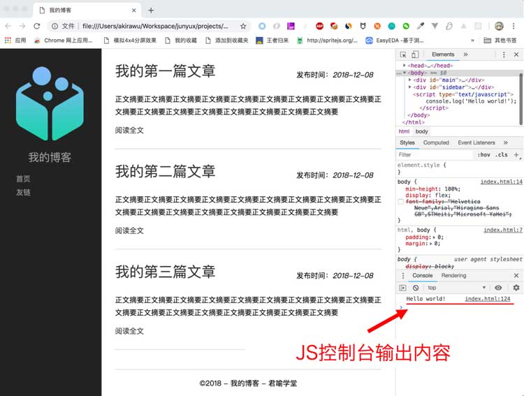
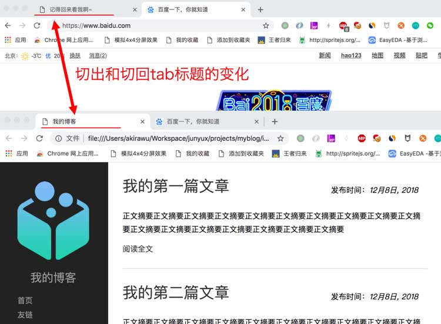

import {JCode} from '@/JCode'

# 用JS改变网页

## JavaScript 初窥

在Web开发中，HTML、CSS和JavaScript各司其责，分别负责**结构、表现和行为**。在前几节课程中，我们了解了如何使用HTML组织页面结构和使用CSS实现设计效果。这一节课我将带领你们初步学习Javascript实现网页和用户的交互。


作为初学者，你可能还暂时不能完全领会这三者职责分离的本质，但是没关系，我们先把这个结论记在心里，通过一些小功能，来直观地体会一下JavaScript能在网页中做什么。

### 嵌入javascript

现在我们先在我们的博客首页中添加一小段JavaScript，让我们在body元素的结束标签之前增加一个script元素：

```html
<!DOCTYPE html>
<html>
  <head>
    ...
  </head>
  <body>
    <div id="main">
      ...
    </div>
    <div id="sidebar">
      ...
    </div>
    <script type="text/javascript">
      console.log('Hello world!');
    </script>    
  </body>
</html>
```



添加了上面的JS后，我们用浏览器打开博客首页，在开发者工具的控制台中就会看到输出字符串`Hello world!`。

在网页中添加script元素，是嵌入JavaScript代码的一种方式，但不是唯一方式，就像在网页中添加style元素，是嵌入CSS代码的一种方式一样，在后续的课程里，我们有机会学习其他加载JavaScript、CSS的方式。

### DOM API

接下来我们修改一下script标签中的代码：

```html
<script type="text/javascript">
  const pubtimeEls = document.querySelectorAll('.pubtime em');
  pubtimeEls.forEach((el) => {
    const date = new Date(el.innerHTML);
    el.innerHTML = `${date.getMonth() + 1}月${date.getDate()}日, ${date.getFullYear()}`;
  });
</script>
```

JavaScript作为一门编程语言，有一整套规范的语法，在后续课程中我们要系统地学习JavaScript的语法和各种用法，在本课程里我们先只求有一个直观的认识即可，好在JavaScript语法简洁直观，本身并不难理解。

在上面的代码里，我们使用`document.querySelectorAll`方法来获得对应的元素。在前面的课程里我们提到过，HTML文档结构上是一棵对象树，称为DOM，即文档对象模型。浏览器为JavaScript提供了可以访问DOM树上各个节点的API（Appilaction Programming Interface），document.querySelectorAll就是其中的一个API，它的参数是CSS选择器，返回值是与该选择器匹配的文档上的所有元素节点。

JavaScript是一门面向对象的语言，一切皆是对象。"."是JavaScript的**对象属性操作符**，`document.querySelectorAll`从语义上来讲，即是**document**对象上的**querySelectorAll**方法。

我们通过`document.querySelectorAll('.pubtime em')`返回了网页上所有的发布时间中显示时间字符串的em元素组成的列表，然后我们通过forEach方法**遍历**这个列表中的每一个元素，通过`innerHTML`属性获取到这些em元素中的文字节点，即`2018-12-08`这样的字符串，然后通过`new Date`使用这些字符串构造出Date类型的对象，然后利用Date对象的`getFullYear()`、`getMonth()`和`getDate()`各方法，将日期转为`x月y日, zzzz（年）`的格式，最后将它替换原来的`innerHTML`属性，最后在网页中呈现的效果如下：

<JCode codeId="7105278769576968206"/>

### Javascript事件

然后，我们给Javascript注册两个window事件：

```html
<script type="text/javascript">
  const pubtimeEls = document.querySelectorAll('.pubtime em');
  pubtimeEls.forEach((el) => {
    const date = new Date(el.innerHTML);
    el.innerHTML = `${date.getMonth() + 1}月${date.getDate()}日, ${date.getFullYear()}`;
  });

  let title = document.title;
  window.addEventListener('blur', () => {
    document.title = '记得回来看我啊~';
  });
  window.addEventListener('focus', () => {
    document.title = title;
  });
</script>
```

上面的代码中，document.title的设置会改变head中title元素的内容，继而影响浏览器tab页上的文字标题。

`window.addEventListener('blur')` 和 `window.addEventListener('focus')` 表示给window对象注册blur和focus事件， 它们分别表示失去焦点和获得焦点事件。addEventListener方法的第二个参数是一个事件方法， 表示当事件发生时，执行这个方法。

这段代码的执行效果是，当我们切换到其他浏览器tab时，博客首页的title改变成字符串“记得回来看我啊~”，而当我们切换回该Tab页时，网页title又恢复成原来的样子。如下图所示：



?> 这个效果在[码上掘金](https://code.juejin.cn)中看不到，因为码上掘金的右侧是内嵌iframe窗口，浏览器不会在标签内显示iframe窗口里面的标题，要看到这个效果，你可以将下面的代码保存到一个本地的`index.html`文件中，然后浏览器打开文件访问，切换标签，就可以看到上面截图中的效果。

<JCode codeId="7105283021548290079"/>

## 小结

从上面的例子，我们可以看到，JavaScript可以通过DOM API访问并改变网页中的内容，还可以通过事件响应用户的行为。实际上JavaScript的能力还远不止如此。在Web开发中，JavaScript通常在网页中承担：

- 用户输入校验
- 动态向服务器提交和获取数据
- 存储和处理用户数据和操作状态
- 丰富页面展现形式等职责。

此外，JavaScript在Web工程中还承担工程化构建和部署、单元测试、集成测试、脚本编译、打点统计等功能以及其他丰富用途。关于JavaScript使用的各个方面，在后续课程中我们会有机会一一深入讲解。