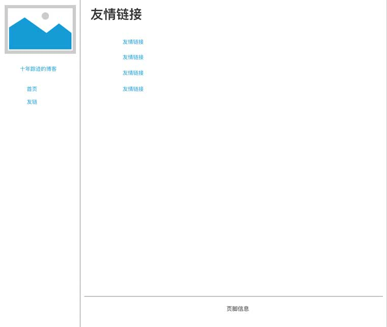

# 设计简单的个人博客吧

## 项目准备

我们要建立的个人博客很简单，初期我们只包含首页、文章页、个人简介、和友情链接这4个页面。

我们分别看一下它们的产品原型图：


<div style="text-align:center;margin:auto;font-size:14px;"><em>首页</em></div> 


<div style="text-align:center;margin:auto;font-size:14px;"><em>文章页</em></div> 


<div style="text-align:center;margin:auto;font-size:14px;"><em>个人简介</em></div>



import { Unsafe } from '@/Unsafe'

<Unsafe>
  <div style={{textAlign:'center',margin:'auto',fontSize:'14px',marginBottom:'24px'}}><em>友情链接</em></div> 
</Unsafe>


根据产品原型，我们要实现4个HTML页面，这四个页面构成一个完整的Web应用，即我们的个人博客。在开始项目之前，我们先创建项目目录并初始化几个文件。我们先给项目起一个名字，叫做myblog，在系统中创建这个目录，并初始化几个子目录和文件，用于后续开发。项目目录和文件结构如下：

```
myblog/
├── about.html  个人介绍
├── article.html  文章页
├── index.html  首页
├── links.html  友情链接
└── static  
    ├── css  外链的CSS 
    ├── image   图片
    └── js   外链的JS
```

如果你使用[GitHub](https://github.com)，你可以从[GitHub仓库](https://github.com/junyux/myblog)中fork这个项目来创建目录和所有的初始文件。如果你之前从未使用过Git管理代码，你可以先花一点时间学习[Git教程](https://www.liaoxuefeng.com/wiki/0013739516305929606dd18361248578c67b8067c8c017b000)之后再继续本课程的学习。熟练使用Git几乎已成为程序员必备的基本功，前端工程师也不例外。当然，如果你想先继续学习课程，以后再学习使用Git，你也可以不使用Git，而是使用命令行终端手动创建上面的目录和文件。

前端开发对于编辑器的依赖很少，你几乎可以使用任何支持unicode的编辑器来做项目开发，但是，一款好的编辑器依然能够大大提升开发效率。在后续课程里，我们会逐步引入一些预编译、规则检查和打包工具，这些工具能够拓展我们的开发能力和提升开发效率。一些出色的编辑器提供快速集成这些工具的插件机制，使用它们能够让我们的开发更加便利。目前常用的前端编辑器有Sublime Text、Atom、WebStorm和Visual Studio Code等等，在本课程里，我们选择使用Visual Studio Code作为我们教学演示的默认编辑器，如果你对编辑器没有特殊的偏好，我推荐你使用Visual Studio Code作为默认的前端开发编辑器。Visual Studio Code是微软推出的开源编辑器，你可以在[这里](https://code.visualstudio.com/)下载和免费使用。

下载安装好Visual Studio Code后，点击菜单“打开文件夹”将myblog文件夹添加到项目资源中。

如果你已经完成上面的准备工作，那么我想你也许已经迫不及待想要动手创建属于你自己的博客了。别着急，我们马上进入下一课，在下一课中，你就可以使用浏览器可识别的语言——HTML——来一步步动手创建自己的博客内容了。
